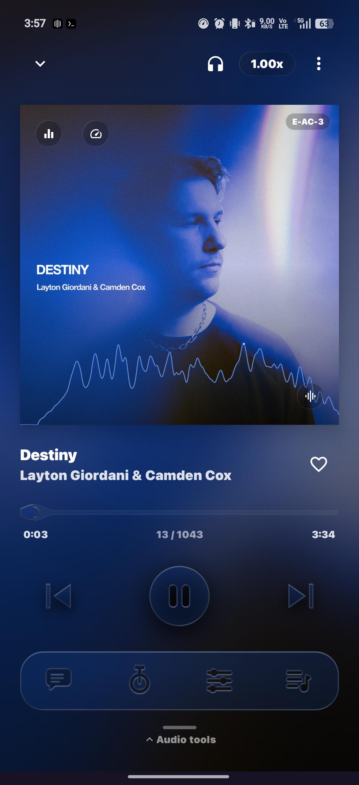
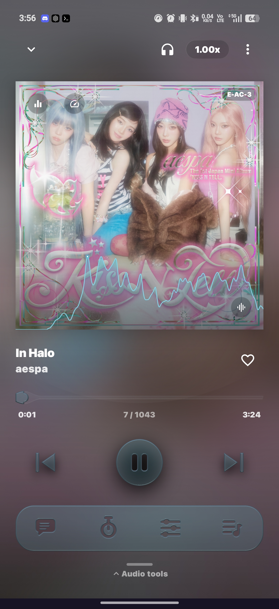

# Changelog

## [1.8.4]

### Fixed
- **A track no longer loads and then sits paused** — Media3 asks for audio focus on the way into play, and a refused request silently flipped playback straight back off, leaving the track stopped at 0:00 until you pressed play. Refusal is likeliest right after a slow load, which is why it showed up on tracks being heard for the first time. A refusal at start-up is now retried; one arriving later in a track, when you've genuinely handed audio to another app, is still left alone.
- **Tapping the album artwork in a song row plays the song** — it used to open the album, which made the biggest, most obvious-looking play target in the row do something else. Album and artist are still on the long-press menu.
- **The artist and album links in a song row are harder to hit by accident** — their touch targets now sit just inside the text, so a near-miss plays the track instead of navigating away.
- **A song tapped right after opening the app no longer does nothing** — the tap resolved fully and was then dropped because the playback session hadn't finished connecting, while still being recorded as a success, so nothing retried and no error appeared. It now waits briefly for the connection.
- **Qobuz tracks are never resolved against TIDAL or Apple Music** — Qobuz is its own catalogue, but only the first track of a Qobuz album was routed to it. Every following track, and every notification or lock-screen skip, went through TIDAL with a Qobuz id, which either fails or plays a different recording entirely under the right title and artwork. Downloads had the same problem in reverse, silently substituting an Apple Music match when Qobuz came up empty.

### Removed
- **ReplayGain** — it never did anything. The mode preference had no UI and nothing in the app ever set it, so it sat permanently at `OFF`, which made the volume calculation a pass-through on every track; and even switched on, gain values only ever reached the player for TIDAL tracks, never for local files, Qobuz, Apple or collections. It's gone from the playback path and from settings, so nothing sounds different. Tags are still read from your files, so nothing is lost if it ever comes back properly.

### Added
- **Anti-alias oversampling across the effects** — the Inflator and the Compressor gain an Off / 2x / 4x control, and the DSP snapins' existing 4x got materially better. Measured on a 9 kHz tone at 44.1 kHz: the Inflator's alias products drop from -17 to -52 dBc, the Compressor's from -38 to -63 dBc. The ladder filter's internal oversampling was zero-stuffing with no filters at all and is now 25 dB cleaner. The distortion's "2x oversampling" turned out not to oversample anything — it shaped each sample twice and averaged, which measured identically to not doing it — so it's gone, and real oversampling from the FX chain does the job.
- **Blend between tracks** — one slider, sitting under the gapless toggle. At zero, tracks run straight into each other with no gap; add time and they overlap instead, the outgoing track fading out as the next fades in. The curves are equal-power, so loudness stays flat through the blend rather than dipping in the middle as a linear fade would. The overlapping track is fully processed — it gets its own copy of the DSP engine and your EQ curves for the length of the blend, which is then torn down — so your sound doesn't drop out across a transition. Skipped while bit-perfect USB output is streaming, since that device can't be shared between two streams.
- **Local copies always play first** — tapping a song anywhere in the app (search, an album or artist page, a playlist, radio, the queue, a lock-screen skip) now plays the file on your device instead of streaming it, whenever you have one. Both stores count: the scanned library and your downloads. Matching is ISRC/MusicBrainz-first and otherwise needs the title, an artist credit and the runtime to line up, so a live take or a different edit is never substituted for the recording you asked for. The decision is cached per song, so skipping around a queue costs nothing.
- **Auto-download liked songs** — a toggle at the top of Settings → Library. With it on, liking a song downloads it. It is forward-only by design: turning it on never touches songs you liked earlier, so it can't kick off a bulk download of an existing Liked Songs list. Songs already on the device are skipped.
- **Gapless playback actually works** — the setting existed and was wired to the Settings screen, but nothing ever read it, so the toggle did nothing. The player now holds the next track alongside the current one so its decoder is already running when the hand-off comes, which is what removes the gap. Applies to on-device files and Qobuz; TIDAL and Apple tracks keep the existing per-track path, because a stream URL queued minutes ahead would have expired by the time it was reached.
- **Faster song start** — playback now begins after 750 ms of buffered audio instead of 2.5 s, on every start and every skip. The old value was described in the code as lowered from the default; it was in fact exactly the Media3 default, so the start-up threshold had never been reduced at all. The post-underrun threshold is unchanged, so a struggling connection still refills properly.
- **A track that loads slowly is no longer skipped past** — a failing position was retried in the same breath and then abandoned, so a song that was merely slow (a cold stream, a signal dip on the hand-off) hit the same not-ready condition on the retry and the second failure moved on within milliseconds of the first. With nothing pacing it, that walked the queue at a few hundred milliseconds a track. Retries are now spaced (~1.2 s, then ~2.4 s) before the queue moves along. Separately, a blend ran on a wall clock from the moment the hand-off started, so a track that took a second to buffer had the outgoing one fading out into a hole; the blend now holds at full until the incoming track is actually sounding and takes the wait out of the fade rather than off the end of the outgoing track.
- **The album art morphs between tracks** — the hero cover, the circular variant and the mini-player thumbnail dissolve into the next one over the blend length, the new cover settling in from slightly oversized over an outgoing one that stays put (fading both would thin the middle of every transition and let the background show through). A skip you asked for still takes 260 ms — a manual skip cancels any blend and cuts the audio, so a slow dissolve would be describing a transition that isn't happening, and the swipe gesture already carries its own slide.
- **The scrubber's playhead is a whole bubble at 0:00** — the glass tube inset the playhead by the bulge's thickness rather than its width, so the raised-cosine skirt around the dot ran off the left edge and the bubble was sliced flat by it at the start of every track (and at the end). The tube's own ends round off now too.
- **The player's colours cross over at the blend length** — the background wash, every album-derived accent (mini player, full player, lyrics) and the blurred artwork backdrop now change track over your "Blend Between Tracks" time instead of fixed 1.3–1.8 s tweens, and gapless gets a short 600 ms fade of its own rather than a hard cut. The queue advances at the *start* of a blend, so with anything above about two seconds the player used to finish repainting for the next song while most of the previous one was still audible. Two related fixes fell out of it: the player's album colours reset to a neutral grey the instant the track changed and then eased to the new ones, so every transition crossfaded old → grey → new; and the blurred backdrop leaned on Coil's crossfade, which is fixed at 100 ms and is skipped outright for a cached cover — which is every cover you have just seen in a list.
- **Downloaded badge** — song rows show a ring with a down arrow when the track is on the device. Unlike the in-flight progress indicator this one persists across restarts, and it appears in Library, playlists, album and artist pages, Home and search.

## [1.8.1] — Apple Music

> Covers everything since 1.7.2, including the unpublished 1.8.0 bump (versionCode 180 → 181).

| The new player | |
|---|---|
|  |  |

### Added

#### Apple Music catalog
- **Apple Music as a searchable source** — Apple Music is wired through the configured instance as a first-class catalog alongside TIDAL and Qobuz, with search, album detail, and artist detail. Apple identity is kept strictly separate from Qobuz ids so nothing cross-contaminates the registries, and the first-run onboarding now presents TIDAL, Qobuz, Apple Music & Spotify with their brand logos.
- **Playback via the wrapper** — streams resolve through `/api/apple/download-music` (wrapper + cloud cache), with an optional **tailnet-direct** mode that talks straight to a home wrapper/agent over your tailnet — no cloud in the path (cleartext HTTP is permitted solely so the app can reach the tailnet agent).
- **Offline downloads** — Apple tracks download as `.m4a` through the same endpoint, and the player resolves the Apple id for the playing track ahead of time so the download button works immediately.
- **Format selection + Dolby Atmos** — Settings gains an Apple Music format preference (hi-res lossless / ALAC / AAC — Apple's ladder doesn't map onto the Qobuz/TIDAL tiers, so it's its own setting) and a separate **Dolby Atmos toggle**: when on, the wrapper is asked for the Atmos spatial master and falls back to your chosen stereo format for tracks with no Atmos encode.
- **ALAC via FFmpeg** — ALAC now decodes with the bundled FFmpeg instead of the platform codec, sidestepping device-dependent decoder quirks.

#### Downloads
- **Expedited, honest, dismissible** — download work runs as expedited foreground jobs, failures are reported honestly instead of hanging as fake progress, and finished/failed rows can be dismissed from the Download Center.

### Changed

#### Player & theming (1.8.0 cycle)
- **Liquid-glass optics rework** — interior lensing and a structured backdrop replace the old flat refraction, with richer shimmer layered into the glass shader.
- **Unified theme roster** — Lyrics FX and Player Glass merge into one 17-pair theme roster; the "55" glass theme ships as the default.
- **Backdrop polish** — the mini player gaussian-frosts the backdrop under its glass slab, the action dock's drop shadow respects its icon cut-outs, and the blurred album background plus "Glow behind album art" (now under Appearance) default ON.

#### Settings & UX
- **Five fixed font sizes** — the free-form font-scale slider is replaced with five fixed sizes plus a follow-system option.
- **One-time donations** — support tips are now one-time only ($3 / $5 / $10); monthly Stripe subscriptions are dropped.

### Fixed
- **Performance tiering** — devices with missing `cpufreq` data are no longer misclassified as weak CPUs (which silently disabled visual effects).
- **No baked-in addresses** — the app no longer ships instance addresses or a real tailnet address as the agent placeholder, and the monochrome.tf website link and deep link are removed.

## [1.7.0] — MonoTrypt DSP Engine

### Added

#### In-app Donations (Stripe)
- **Recurring donation subscriptions** — Settings › About gains a "Support the app" card with monthly tip tiers ($3 / $5 / $10) that open Stripe's **PaymentSheet in-app** (card by default; Google Pay is a one-config-line add-on) so the donor never leaves Tryptify. On success the card shows a thank-you; Ko-fi stays as a one-tap one-time fallback. The tier picker disables while a subscription is being prepared/presented, and backend failures surface inline instead of crashing.
- **Secret-free client** — the app embeds no Stripe key. A new `DonationBackend` calls the `create-donation-subscription` Supabase Edge Function (reusing the existing project URL + public anon key) which holds the Stripe **secret** key, creates/reuses the customer, mints an ephemeral key, and returns an incomplete subscription's PaymentIntent client secret + publishable key. `DonateViewModel` keeps all Stripe UI types out of the ViewModel; `DonateSupportCard` owns the PaymentSheet and maps its result back in.
- **Cancel from inside the app** — once subscribed, the Support card remembers it (device-local `DonationStore`, survives restarts) and swaps the tier picker for a "You're a monthly supporter" note with a **Cancel subscription** button + confirm dialog. Cancelling calls a second Edge Function (`cancel-donation-subscription`) that stops future charges; it's idempotent, so a subscription already cancelled from the Stripe receipt still clears the local record cleanly.
- **Edge Function + docs** — `supabase/functions/create-donation-subscription/` ships the Deno/Stripe function (customer reuse by email, inline recurring `price_data`, `payment_behavior=default_incomplete`, amount range guard, CORS) plus a README covering secret setup, deploy, the test card, and the Google Play donation-policy caveat (donations unlock no app features). Adds the `com.stripe:stripe-android` dependency.

#### Radio Queue Maker
- **Radio (queue maker)** — new `RadioQueueManager` seeds a station from the playing track, asks the optional Tryptify-Playlist planner (`POST /api/radio/plan`, `catalog: "qobuz"`) for query/candidate hints, and resolves everything against the configured Qobuz (trypt-hifi) instance: hints and queries via `searchQobuz` (ids auto-register in `QobuzIdRegistry`, so appended tracks play through the QobuzCached path), the on-device backbone from the seed artist's top tracks plus similar-artist expansion (`getQobuzArtist`), with the seed's Qobuz artist id recovered directly or via the TIDAL→Qobuz alias map. Dedupes against the queue/history/session by id and normalized artist|title and appends batches through `QueueManager` with automatic refill near the queue tail. The planner is strictly advisory — radio keeps running on Qobuz similar-artist expansion without it, TIDAL is used only when no Qobuz instance is configured, and a queue reset stops radio so it can't instantly refill the tail the user just rejected.
- **Planner client** — `RadioPlannerClient` posts seed + user weights + play history + MetaBrainz identities (ISRC / MusicBrainz recording ids from local tags via `UnifiedTrackRegistry`) with a 25 s budget, tolerant response parsing (`ignoreUnknownKeys`), and a seed-only retry if a stricter server rejects the extended request shape. `/health` powers the settings connection test.
- **Settings › Radio tab** — planner enable toggle, planner URL (defaults to the production Railway deployment), bearer API key, connection test, and 14 user-tunable recommendation weight sliders (local library, novelty, familiarity, artist/genre similarity, mood, era, repeat avoidance, MetaBrainz/ListenBrainz/canonical bias, discovery distance) persisted in DataStore, clamped to 0.0–3.0 with non-finite values falling back to defaults.
- **Manual queue editing** — queue sheet gains reset-queue (confirmation dialog, keeps the current track playing), row long-press menu (Play next / Start radio from this song / Select / Delete), multi-select deletion, and drag-handle long-press reorder. New `QueueManager` APIs (`clearUpcoming`, `removeMany`, `move`, `moveToPlayNext`) preserve the current track's identity through every edit; unit tests cover the index math.
- **Home: Play Radio + on-demand search** — the persistent home search bar is replaced by a prominent themed Play Radio button (seeds from the playing track, falling back to the most recent history entry, then a favorite; shows generating/active state and stops on second tap). Search moves behind a top-bar toggle that reveals an auto-focused search field and clears the query on close. Queue radio can also (re)seed the running station from any specific queue row.
- **Send to queue everywhere** — local album/artist/genre detail rows and the folder browser gain a per-row add-to-queue button (registering through the unified path so local/Qobuz sources resolve correctly), completing coverage alongside the existing context-menu option on catalog rows.

#### Word-Level Lyrics
- **NetEase + Kugou fallback sources** — `getLyrics` now tries two more free, no-auth catalogs for per-word (karaoke-style) timing before dropping to LRCLib's line-only sync: `NetEaseLyricsClient` (music.163.com search + `yrc` word-level payload) and `KugouLyricsClient` (krcs.kugou.com search + KRC blob, XOR + zlib decoded, word offsets relative to each line). Both match by title/artist (+ closest duration when known) and degrade to null on any bad response, timeout, or format surprise, so a source hiccup just falls through the chain instead of breaking lyrics. Full order is now: TIDAL word-level → NetEase word-level → Kugou word-level → LRCLib line-level. Unit tests cover both parsers plus a synthetic KRC encode/decode round-trip.
- **Provider selector** — Settings › Interface gains a three-way "Word-level lyrics provider" segmented control (`LyricsWordProvider`: NetEase only / Kugou only / Both, default Both) that governs which karaoke-timing source(s) run when the instance has no synced lyrics; Both keeps the NetEase-first, Kugou-fallback order.
- **Sharper, deeper 3D lyric type** — active lines render ExtraBold with tight −0.2sp tracking (identical tracking on inactive lines so activation never reflows the list); the wide soft glyph shadow (blur up to ~17px, which hazed edges) is replaced by a crisp contact shadow plus a true extruded backing glyph stamped inside the same per-letter transform layer, so the dark copy tilts with the letter and reads as solid block depth. Wave amplitudes deepen (translation 2.2→3dp, rotationX ×1.3→×1.6, swell 0.06→0.09) and the tunable defaults move to rotation 12°, shadow depth 0.7.
- **Bass-reactive lyrics (Nightcore-style)** — the active line reacts to the music in real time from the existing `SpectrumAnalyzerTap` FFT (40–110 Hz bins → dB level → attack/release envelope → underdamped spring, so kicks overshoot and ring once — bounce, not jitter). The pulse drives a scale pump, a soft accent-colored radial glow, and slowly-rotating god rays that emanate from the active line's own letter borders (roots on the glyph-block ellipse; ray/glow gradients reach full transparency at their endpoints, so the light dissolves in open space and no container edge is ever silhouetted). Each new line pops in with its own spring right on the beat that activated it. Everything is draw-phase only (zero per-frame recomposition) and the analyzer stake is ref-counted to the lyrics being on screen. The god ray is a reusable **element FX** (`Modifier.bassBeat`) applied to the font, not a separate backdrop layer.
- **Lyrics FX Studio** — a dedicated vizzy-style editor (Settings › Interface › Lyrics Appearance › Lyrics FX Studio) exposes the entire lyric renderer as ~20 live sliders over a self-animating preview that runs a synthetic 120 BPM kick through the real envelope+spring pipeline, so every knob is visible without music playing. Groups: Typography (size, tracking), 3D Letter Wave (tilt, speed, tightness, travel, shadow), Beat Engine (bass reaction, pump, attack, release, bounce, pop-in), and God Rays & Glow (count, length, width, brightness, spin, glow radius/brightness). Named presets (Default / Nightcore / Subtle / Still) and reset. All parameters persist as one JSON blob (`LyricsFxSettings`, clamped on read/write, unknown-key tolerant) that supersedes — and migrates from — the old four per-field lyric sliders.

#### Spotify Import Foreground Service
- **Imports survive leaving the screen** — Spotify playlist imports (URL, picker, Liked Songs) now run in `SpotifyImportForegroundService` (`dataSync` foreground type) instead of a ViewModel scope, so a 1,000-track import no longer dies when Settings closes or the app backgrounds. The service shows a persistent notification with a determinate progress bar fed by the shared `PlaylistImportService.progress` flow — "Matching 214 of 1,038 · 197 found" — that keeps counting until the entire playlist is matched, then swaps to a dismissible result summary (imported/total or the failure reason). A Cancel action stops mid-import. Notification updates are throttled to ~2/s so NotificationManager rate-limiting can't freeze the bar, `isImporting` is derived from the shared flow so a recreated Settings screen still shows a running import, and the old in-ViewModel import path is removed so nothing can bypass the service.

#### THX Spatial Audio
- **THX detection + highlighted badge** — Qobuz marks THX Spatial Audio releases only via the `version`/`title` text (`isThxSpatialAudio` regex, mirroring trypt-hifi). The structured flag now flows through the Qobuz→domain mappers into `Track`/`Album`/`UnifiedTrack`/`UnifiedAlbum`, and a solid-primary "THX" pill renders in search rows and album cards, streaming album detail, the now-playing tag, downloaded-track rows, and every `TrackItem` list.
- **Download tag survival** — `DownloadedTrackEntity` gains `version` + `isThxSpatialAudio` (Room migration 8→9, backfilled from existing titles); the download worker embeds Vorbis comments into the FLAC (`TITLE` without the version suffix, `VERSION` = the raw Qobuz string, `COMMENT` = "THX Spatial Audio") via JAudioTagger so the designation survives offline and export.
- **Scanner re-derivation** — the library scanner detects THX from a scanned file's title/album, and for FLAC reads back the embedded `VERSION`/`COMMENT`, so re-scanned or sideloaded THX files light up the badge with no DB history (`local_tracks.isThxSpatialAudio`).

#### Multichannel Downmix
- **DownmixProcessor** — ITU-R BS.775 Lo/Ro multichannel (3.0–7.1) → stereo fold-down at the head of the AudioProcessor chain (both the DefaultAudioSink and exclusive-USB paths). Row-normalized coefficients (clip-proof by construction), LFE dropped, PCM16 + float, inactive passthrough for mono/stereo. Fixes fatal playback failure on 5.1/7.1 FLAC and FFmpeg-decoded surround sources.
- **"Downmix multichannel to stereo" setting** (Audio Processing, default on) — off passes multichannel PCM straight to the device (`MixBusProcessor`/`AutoEqProcessor`/`ParametricEqProcessor` now deactivate for >2 ch instead of throwing, so DSP/EQ are bypassed rather than playback failing).
- **5.1/7.1 track badges** — Qobuz `maximum_channel_count` now flows into `Track`/`UnifiedTrack.channelCount`; multichannel pills render in track rows and the now-playing source/format tag.
- **LibusbAudioSink lazy-engage fix** — mid-stream bypass engagement now negotiates the DAC against the post-chain output format (matching `configure()`), instead of the sink input format's channel count.

#### Native C++ DSP Engine
- **Core engine** (`app/src/main/cpp/dsp/`) — 4 mix buses + 1 master bus with per-bus gain, pan, mute, and solo. Plugin chains up to 16 slots per bus. Full state serialization to JSON for preset save/load.
- **JNI bridge** — Follows existing ProjectM native pattern. Separate `monochrome_dsp` shared library compiled with `-O3 -ffast-math` and ARM NEON auto-vectorization.
- **11 shared DSP utilities** — Biquad (RBJ cookbook), delay line (cubic interpolation), envelope follower (peak/RMS), LFO, allpass, DC blocker, Hilbert transform, oversampler (2x half-band), lookahead buffer, crossfade buffer (Hann OLA), transfer curve (256-point LUT).

#### 33 Audio Processors
| # | Processor | Category | Algorithm |
|---|-----------|----------|-----------|
| 1 | **Gain** | Utility | Volume with 5ms exponential smoothing |
| 2 | **Stereo** | Utility | M/S encode → independent mid/side gain → decode → equal-power pan |
| 3 | **Filter** | EQ & Filter | RBJ biquad, 7 types (LP/BP/HP/Notch/Shelf/Peak), 1x–4x slope |
| 4 | **3-Band EQ** | EQ & Filter | Linkwitz-Riley crossover (2x Butterworth) with per-band gain |
| 5 | **Compressor** | Dynamics | Feed-forward, RMS/peak detection, hard knee, makeup gain |
| 6 | **Limiter** | Dynamics | Brickwall lookahead (5ms), true peak scan, instant attack |
| 7 | **Gate** | Dynamics | Hysteresis threshold, lookahead, hold, flip mode |
| 8 | **Dynamics** | Dynamics | Dual-threshold upward/downward compressor, soft knee, parallel mix |
| 9 | **Compactor** | Dynamics | Lookahead limiter/ducker, RMS/Peak/ISP detection, stereo linking |
| 10 | **Transient Shaper** | Dynamics | Dual envelope (fast/slow), attack/sustain gain, pump ducking |
| 11 | **Distortion** | Distortion | 6 modes (tanh/saturate/foldback/sine/hardclip/quantize), dynamics preservation |
| 12 | **Shaper** | Distortion | 256-point transfer curve, cubic interpolation, 3 overflow modes |
| 13 | **Chorus** | Modulation | 1–6 voice LFO-modulated delay, cubic interpolation, stereo spread |
| 14 | **Ensemble** | Modulation | 2–8 voice allpass phase modulation, 3 motion modes |
| 15 | **Flanger** | Modulation | Short delay + feedback, barberpole scroll via cascaded allpass |
| 16 | **Phaser** | Modulation | 2–12 cascaded allpass stages, exponential LFO sweep |
| 17 | **Delay** | Space | Up to 2s, feedback, ping-pong, input ducking, pan |
| 18 | **Reverb** | Space | 8-line FDN, 4 allpass diffusers, Hadamard mixing, per-line damping |
| 19 | **Bitcrush** | Distortion | Sample rate + bit depth reduction, TPDF dither |
| 20 | **Comb Filter** | EQ & Filter | Feedforward with polarity flip, stereo widening mode |
| 21 | **Channel Mixer** | Utility | 2×2 stereo routing matrix |
| 22 | **Formant Filter** | EQ & Filter | 2D vowel selector, dual peaking EQ at formant frequencies |
| 23 | **Frequency Shifter** | Modulation | SSB modulation via Hilbert allpass pair |
| 24 | **Haas** | Utility | Inter-channel delay (0–30ms) for precedence-effect widening |
| 25 | **Ladder Filter** | EQ & Filter | 4-pole Moog/diode analog model, tanh/asymmetric saturation, 2x OS |
| 26 | **Nonlinear Filter** | EQ & Filter | SVF with 5 waveshaping modes in integrator feedback |
| 27 | **Phase Distortion** | Distortion | Hilbert-based self-phase modulation, envelope normalization |
| 28 | **Pitch Shifter** | Modulation | Granular overlap-add, Hann window crossfade, jitter |
| 29 | **Resonator** | EQ & Filter | Tuned feedback comb, saw/square timbre, one-pole damping |
| 30 | **Reverser** | Space | Segment capture → backwards playback with crossfade |
| 31 | **Ring Mod** | Modulation | Sine carrier, bias, rectification, stereo spread |
| 32 | **Tape Stop** | Modulation | Variable-rate playback ramp with exponential curve |
| 33 | **Trance Gate** | Dynamics | 8-pattern step sequencer, ADSR envelope, 4 resolutions |

#### Kotlin Integration
- **MixBusProcessor** — Media3 `AudioProcessor` inserted into ExoPlayer pipeline after EQ. Handles PCM16 and float formats, stereo deinterleave/interleave, JNI bridge to native engine.
- **DspEngineManager** — Singleton managing bus state via `StateFlow`. Exposes bus controls, plugin chain CRUD, parameter updates, and state serialization.
- **SnapinType** — Enum of all 33 processor types with display names, categories, and availability flags.
- **Data models** — `BusConfig`, `PluginInstance`, `MixPreset` with kotlinx.serialization.
- **DspModule** — Hilt DI module providing `MixBusProcessor` and `DspEngineManager` as singletons.

#### Persistence
- **MixPresetEntity** — Room entity for mixer preset storage (JSON-serialized engine state).
- **MixPresetDao** — Room DAO with Flow-based queries.
- **MixPresetRepository** — Domain-layer preset CRUD.
- Database schema bumped v3 → v4 (destructive migration).

#### Mixer UI
- **MixerScreen** — Main mixer console with horizontal bus strip layout, plugin chain view, FAB for adding plugins.
- **BusStrip** — Channel strip composable: gain fader, pan slider, mute/solo buttons, plugin count.
- **PluginSlot** — Plugin entry with bypass toggle and remove button.
- **PluginPickerDialog** — Categorized plugin selection dialog.
- **PluginEditorSheet** — Bottom sheet with parameter sliders per plugin type.
- **MixerViewModel** — Hilt ViewModel bridging UI to DspEngineManager and MixPresetRepository.
- Navigation route `Screen.Mixer` added to `MonochromeNavHost`.

### Changed
- **PlaybackService** — `MixBusProcessor` injected and added to `DefaultAudioSink` audio processor array before the ProjectM visualizer tap.
- **MusicDatabase** — Added `MixPresetEntity`, version 3 → 4.
- **DatabaseModule** — Added `MixPresetDao` provider.
- **CMakeLists.txt** — Added `monochrome_dsp` shared library target alongside existing `monochrome_visualizer`.

### Architecture
```
ExoPlayer → ReplayGainProcessor → EqProcessor → MixBusProcessor → ProjectM Tap → AudioSink
                                                       ↓ (JNI)
                                              NativeDspEngine (C++)
                                              ┌──────────────────────────┐
                                              │  Input Buffer (stereo)   │
                                              │         ↓                │
                                              │  Bus 1 [plugin chain]    │
                                              │  Bus 2 [plugin chain]    │
                                              │  Bus 3 [plugin chain]    │
                                              │  Bus 4 [plugin chain]    │
                                              │         ↓ Sum            │
                                              │  Master [plugin chain]   │
                                              │         ↓                │
                                              │  Output Buffer           │
                                              └──────────────────────────┘
```
