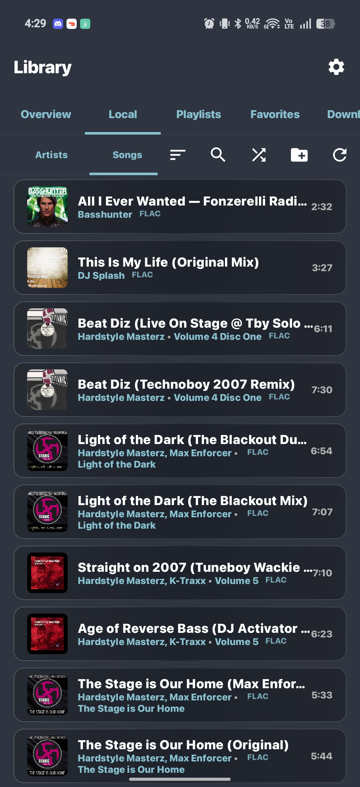
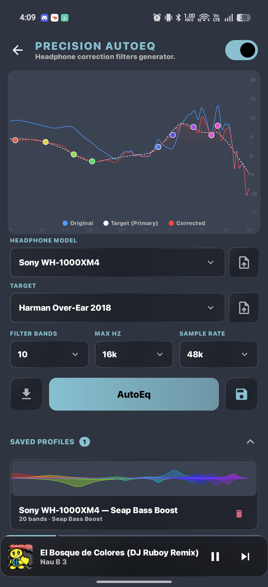
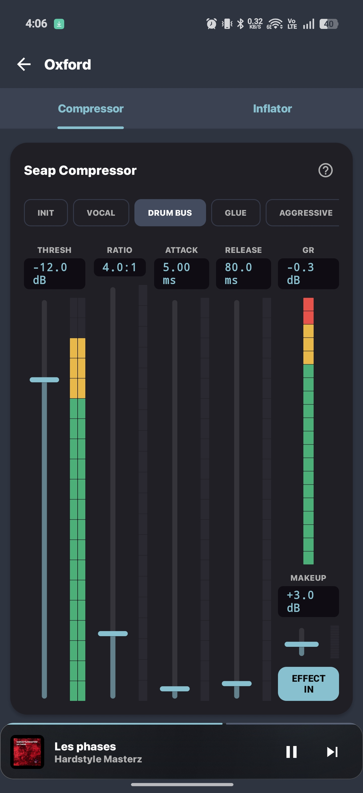
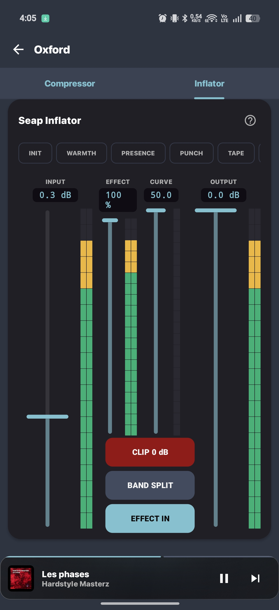
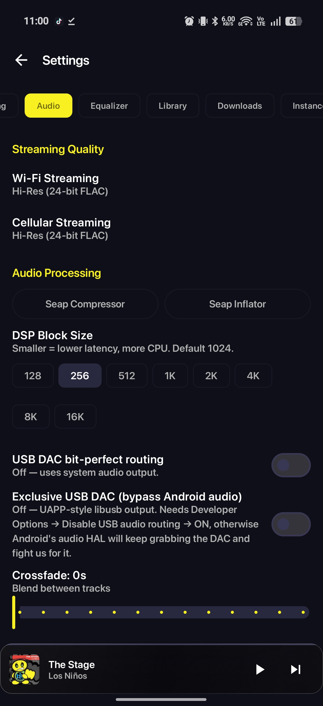

| The new player | |
|---|---|
|  |  |# Tryptify

> A native Android hi-fi player and streaming client built around a **C++17 DSP engine**, a clean-room **Dolby Atmos object renderer**, a headphone **AutoEQ** driven by real measurement data, and **bit-perfect USB-DAC output** over a USB Audio Class driver.

-3DDC84?logo=android&logoColor=white)


Tryptify is an audiophile-grade music player whose interesting parts live below the UI. A Jetpack Compose / Material 3 front end sits on top of a native signal-processing core: a 34-processor DSP mixing console, a parametric AutoEQ that synthesises correction filters from published headphone measurements, an E-AC-3 JOC → object → binaural Atmos renderer written clean-room from the ETSI specs, and a libusb-based driver that writes PCM directly to external DACs — bypassing the Android audio HAL for a bit-perfect path.

It plays a local FLAC/lossless library **and** streams from TIDAL, Qobuz and Apple Music through your own instance, imports playlists from Spotify, renders a real-time ProjectM visualizer off the post-DSP stream, and ships as a single installable app.

<sub>Formerly **MonoTrypT**. Application id and on-device storage are unchanged, so existing installs upgrade in place.</sub>

---

## Screenshots

| Now Playing | Now Playing (frosted glass) |
| :---: | :---: |
|  |  |

| Now Playing (album view) | Audio tools |
| :---: | :---: |
|  |  |

| Library | AutoEQ |
| :---: | :---: |
|  |  |

| Compressor | Inflator |
| :---: | :---: |
|  | <br>|

| Settings | ProjectM Visualizer |
| :---: | :---: |
|  |  |

---

## Highlights

- **Streaming + local, one library** — TIDAL, Qobuz and Apple Music resolve through your own instance alongside the on-device library, with per-source search filters, cross-catalog identity tracking, and offline downloads that keep their real quality and tags.
- **Dolby Atmos object rendering** — raw E-AC-3 frames are tapped before the decoder so the JOC/OAMD side data survives; objects are reconstructed and rendered to binaural stereo through an HRTF, or panned to 5.1 / 7.1 / 7.1.4 via VBAP. Written clean-room from the ETSI specifications.
- **Native DSP mixing console** — 4 buses + master, **34 original C++ audio processors** (up to 16 per bus), ARM NEON SIMD, lock-free parameter updates between the UI and audio threads, true bypass when off.
- **Headphone AutoEQ** — a 10-band parametric generator that builds correction filters from **4,000+ frequency-response measurements**, 10 target curves, measurement-rig–aware filtering, and custom CSV/TXT import — plus a **system-wide** mode that corrects every app on the device.
- **Bit-perfect USB-DAC output** — a libusb **UAC1 + UAC2** driver that claims the streaming interface from the kernel and drives the isochronous endpoint directly, with asynchronous-feedback pacing and a watchdog fallback.
- **A player you can rebuild** — a physically-based liquid-glass render for the transport chrome and a **Player Visuals Studio** that exposes the lyric renderer and the glass optics as live sliders over **17 coordinated themes**.
- **Word-level lyrics** — karaoke-timed lyrics from four sources with automatic fallback, bass-reactive typography, and optional romaji transliteration.
- **Modern Android surface** — Compose + Material 3 throughout, a Glance home-screen widget, a dedicated car mode, importable fonts, 18 color themes, and album-art dynamic coloring scoped to the player so menus stay legible.

---

## Streaming & catalogs

Tryptify is a client, not a service: it talks to **instances you configure yourself** (Settings › Instances). There is no bundled public pool and no address is shipped in the app.

| Source | Endpoint family | Notes |
| --- | --- | --- |
| **TIDAL** | `/search`, `/album`, `/artist`, `/track`, `/lyrics`, `/recommendations` | Instance rotation with retry on 429/5xx, 200-entry LRU cache (30 min TTL) |
| **Qobuz** (trypt-hifi) | `/api/get-music`, `/api/get-album`, `/api/get-artist`, `/api/download-music` | Quality codes 5 / 6 / 27 (MP3 320 · lossless · hi-res) with hi-res→lossless retry |
| **Apple Music** | `/api/apple/get-music`, `/api/apple/get-album`, `/api/apple/get-artist`, `/api/apple/download-music` | Normalised server-side into the Qobuz envelope, so parsing is shared |
| **Local** | MediaStore + folder roots | Indexed on-device library |
| **Collections** | encrypted manifest import | Direct-link playback source |

**Search** — every configured catalog runs in parallel alongside the local library and collections, merged into one result list. Chips filter by type (tracks / albums / artists / playlists) and by source (TIDAL / Qobuz / Apple Music / local / collections), each with its own paging cursor, and a global mode can pin playback to a single catalog. A failure in one catalog is swallowed so the others still return. Recent queries are kept as the empty state.

**Cross-catalog identity** — a persisted `QobuzIdRegistry` maps numeric ids to Qobuz album slugs and remembers Qobuz/Apple track, album and artist ids, so navigating to an album or artist works no matter which catalog the track came from. TIDAL→Qobuz fallback matches by **ISRC** first and falls back to a strict title+artist comparison; the Apple bridge scores title, artist and duration and refuses anything below its threshold rather than substituting the wrong track.

### Apple Music

Apple's format ladder doesn't map onto the Qobuz/TIDAL tiers, so it gets its own preference: **hi-res lossless / ALAC / AAC** (default ALAC). A separate **Dolby Atmos toggle** asks the wrapper for the spatial master and lets it fall back to your chosen stereo format for tracks with no Atmos encode.

Two transports:

- **Tailnet-direct** — with a wrapper URL set, the app posts to your home agent's `/decrypt` endpoint behind a shared secret and polls for the finished file. No cloud in the path.
- **Cloud** — without one, it uses the instance's `download-music` endpoint and reads the stream URL out of the delivery manifest.

ALAC is decoded by **FFmpeg** rather than the platform codec: the MediaCodec selector returns an empty decoder list for `audio/alac`, forcing ExoPlayer onto `FfmpegAudioRenderer`, because some devices' vendor ALAC decoders produce silence.

### Playlists & import

- **Spotify** — Authorization Code + **PKCE** OAuth in a Custom Tab, with the verifier and state persisted so the flow survives process death, and rotated refresh tokens written back. Imports playlists by URL, from a picker, or your entire Liked Songs.
- **Imports survive leaving the screen** — matching runs in a foreground service with a determinate progress notification ("Matching 214 of 1,038 · 197 found") and a Cancel action, then swaps to a dismissible summary.
- **CSV** — Exportify-format import with a quote-aware parser, auto-detected delimiter and European decimals.
- Matching searches Qobuz first (so ids register for later navigation) and falls back to TIDAL per track; a strict album mode leaves a row unmatched rather than substituting a remaster.

### Radio

A queue maker that seeds a station from the playing track and keeps the tail topped up. It resolves everything against your Qobuz instance — the seed artist's top tracks plus similar-artist expansion — and refills automatically as you approach the end of the queue.

An optional **planner** (`/api/radio/plan`) can supply query and candidate hints, with **14 tunable weights** (local library, novelty, familiarity, artist/genre similarity, mood, era, repeat avoidance, MetaBrainz/ListenBrainz bias, discovery distance) and MetaBrainz identities (ISRC, MusicBrainz recording ids) pulled from local tags. The planner is strictly advisory: if it's offline, radio keeps running on similar-artist expansion and says so in its status line.

---

## Now Playing

The player chrome is a **physically-based liquid-glass render**, not a translucent overlay: an AGSL runtime shader with Schlick Fresnel, refraction that drives interior slab parallax, per-channel chromatic dispersion, a procedural environment reflection, a gloss specular term, and frost as per-pixel micro-roughness. The bevel normal is derived from the content's own alpha field, so it's draw-only — layout is untouched. A single ref-counted gravity-sensor listener drives tilt reactivity for every glass surface at once, and the glass lenses the real album tones rather than a flat wash.

Glass is applied to the transport buttons, the action dock (one slab with the icons punched out as true holes, its shadow punched to match), the mini player, the lyric glyphs, and a glass "thermometer" progress bar that fills with a sine-wave bulge at the playhead. Pressing a dock button swells the glass into a dome under your finger.

> The shader path needs **Android 13 (API 33)** or newer. Below that — or if shader compilation fails — every glass entry point degrades to a blurred panel instead of failing.

### Player Visuals Studio

Settings › *Now Playing Appearance* opens a live editor over a self-animating preview driven by a synthetic beat, so every control is visible without music playing. The previews are the real components — the actual transport disc, action dock, progress tube and mini player, not mockups. Three tabs over two parametric systems:

| Tab | Styles |
| --- | --- |
| **Lyrics** | Typography, the 3D per-letter wave, the bass beat engine, the reactive glow, per-lyric glass |
| **Player Glass** | The refractive glass on the transport buttons, action dock and progress tube |
| **Mini Player** | The same glass model, kept as its own independent blob |

A **theme** is a matching pair, and the roster is unified — every name exists in both systems, so picking it on both tabs composes one coherent look:

`Default` · `Chrome` · `Frosted` · `Neon` · `Voltage` · `Glacier` · `Bloom` · `Midnight` · `Silk` · `Hyper` · `Prism` · `Mirage` · `Aurora` · `Onyx` · `Halo` · `Ticker` · `Static`

Presets carry **geometry and optics only — never colour or font**. Player and lyric colours are derived from the album's extracted palette at runtime; a unit test enforces that no preset pins a colour, and applying a theme never clobbers personal fields like your imported font, Bluetooth sync delay or glass tint.

You can save your own themes, and **share them as a code** (`TRYPTFX1:` / `TRYPTGLASS1:`) that anyone can paste in — decoding re-clamps every value, so a hostile code can't push parameters out of range. Adding a built-in theme is appending one `Pair` to each system's `PRESETS` list; the Studio renders the list, so no UI edit is needed. See the bundled `player-visuals-themes` skill for every field, its range, and the rules that keep the tests green.

### Playing, queueing, watching

Four view modes sit behind the artwork — **cover art, lyrics, queue and visualizer**. The queue is editable in place: long-press drag-to-reorder with drop targets computed from real item bounds, per-row *Play next* / *Start radio from this song* / delete, multi-select bulk delete, and a reset that keeps the current track playing (behind a confirmation you can switch off).

Playback speed is continuously variable with an independent pitch-preservation flag, plus a one-tap **Nightcore** preset (1.10× with pitch riding the tempo). **ReplayGain** applies track or album gain with true peak protection — reading local `REPLAYGAIN_*`/R128 tags, collection values and API-supplied values — as player-volume scaling rather than a filter in the PCM path, so it costs nothing in the chain.

The **spectrum analyzer** runs a radix-2 FFT (4096 / 8192 / 16384 points, chosen by device tier) into 256 log-spaced bins across 20 Hz–20 kHz, pink-noise compensated so pink sits flat on 0 dB, with SPAN-like attack/release smoothing. It only spins while something is actually watching it. The **ProjectM** visualizer renders off its own post-DSP tap and advances its preset the moment the track changes.

### Lyrics

Four sources are tried in order, degrading gracefully at every step: **TIDAL word-level → NetEase word-level → Kugou word-level → LRCLib line-level**. A three-way setting picks which karaoke-timing providers run. Any bad response, timeout or format surprise falls through the chain instead of breaking lyrics.

The active line renders as extruded 3D type with a per-letter wave, and reacts to the music in real time from the FFT tap: 40–110 Hz bins drive an attack/release envelope into an underdamped spring, so kicks overshoot and ring once — bounce, not jitter. The glow blooms on a full-screen layer registered to the active line's own glyph bounds, so no container edge is ever silhouetted. Japanese lyrics can be transliterated to **romaji**, and a Bluetooth sync offset (−500 to +1500 ms) compensates for wireless latency.

Tapping a line seeks; lyrics expand to genuine fullscreen when synced, with the transport hiding and the edges dissolving into the blurred album backdrop.

---

## Spatial audio

### Dolby Atmos object renderer

Media3's pipeline discards the JOC/OAMD side data an Atmos stream carries, so Tryptify taps the **raw E-AC-3 access units before the decoder** and pairs each 1536-sample frame with the decoded bed PCM. The native renderer reconstructs the objects and places them; frames without JOC fall back to an ITU downmix, so audio never drops. The processor sits at the front of the sink's chain and returns `NOT_SET` for stereo/mono input, leaving non-Atmos playback completely untouched.

| Setting | Options |
| --- | --- |
| **Renderer mode** | Direct — bit-perfect passthrough (default) · Object render (full JOC via HRTF/VBAP) · Bed + HRTF |
| **Target layout** | 2.0 · 5.1 · 7.1 · 7.1.4, auto-detected by default |
| **Stereo fold-down** | Binaural (HRTF, default) · Stereo Lo/Ro · Surround Lt/Rt (Pro Logic re-expandable) |
| **Also tunable** | Binaural strength · height virtualization · bass management + crossover · LFE gain · DRC · dialog normalization |

Object rendering is **opt-in**: the shipped default is Direct passthrough, so nothing touches your audio until you turn it on. HRTF profiles load from SOFA files, with a browser for the HRTF database.

The native side (`cpp/atmos/`) is **clean-room from the public ETSI specifications** (TS 102 366 / A/52 for E-AC-3 + EMDF, TS 103 420 for OAMD + JOC): an MSB-first bit reader with the `variable_bits` escape, EMDF container framing, OAMD coordinate math, and a VBAP panner (2-D adjacent-pair, 3-D tightest-triplet) — each host-tested for invariants like energy preservation and non-negativity. HRTFs load from SOFA files at runtime via vendored **libmysofa**.

> The `cavern/` subtree (QMF filterbank, JOC decoder, OAMD frame decode) is **ported from [Cavern](https://github.com/VoidXH/Cavern), not clean-room**, and carries a non-commercial / attribution licence — see `app/src/main/cpp/atmos/cavern/NOTICE.md` before shipping this commercially.

### Multichannel downmix

An ITU-R BS.775 Lo/Ro fold-down (3.0–7.1 → stereo) sits directly after the Atmos stage on both the default and exclusive-USB paths, covering everything the object renderer didn't take. Coefficients are row-normalised so it's clip-proof by construction, LFE is dropped per the BS.775 default, and mono/stereo passes through untouched. Layout tables cover 3–8 channels; Media3 carries only a channel count, so an exotic layout folds with the wrong positions but never crashes. A **"Downmix multichannel to stereo"** toggle (default on) lets you send multichannel PCM straight to the device instead; DSP and EQ deactivate above 2 channels rather than failing playback.

### THX Spatial Audio

Qobuz marks THX releases only in free text, so the flag is parsed and threaded through the domain models into a solid **THX** pill in search rows, album cards, streaming detail, the now-playing tag and downloaded-track rows. Downloads embed it in the FLAC as Vorbis comments (`VERSION` + `COMMENT`), and the library scanner reads it back, so the badge survives offline and re-scans.

---

## DSP Mixer

The core is a C++17 native library (`monochrome_dsp`) embedded inside the ExoPlayer audio pipeline. It uses ARM NEON SIMD, denormal flush-to-zero, and lock-free atomic state hand-off so the real-time audio thread never blocks on the UI.

The full sink chain, in order:

```
ExoPlayer → Atmos → Downmix → MixBusProcessor (JNI) → AutoEQ → ParamEQ → Spectrum tap → ProjectM tap → AudioSink
                                       │                                                                    │
                                 Native DspEngine                                     ┌─────────────────────┴──────┐
                                 ├─ Bus 1  [≤16 plugins]                              │  default → DefaultAudioSink
                                 ├─ Bus 2  [≤16 plugins]                              │  bypass  → LibusbAudioSink
                                 ├─ Bus 3  [≤16 plugins]                              │             (libusb UAC)
                                 ├─ Bus 4  [≤16 plugins]                              └────────────────────────────┘
                                 ├─ Sum ─────────────────┐
                                 └─ Master [≤16 plugins] ┘
                                       └→ Oxford Inflator → Compressor (inline, post-chain)
```

Each bus has gain (dB), pan, mute, solo, and input-enable. The master sums active buses, runs its own plugin chain, and meters the output with peak + hold ballistics — and keeps running when the mixer is bypassed, so a master-bus AutoEQ survives the toggle. Engine state serialises to JSON and persists in Room. Processing block size is user-selectable from 128 to 16384 samples (default 1024), and the native scratch buffers are preallocated to the maximum so a change never reallocates on the audio thread.

**Presets** — seven built-ins ship with the app (Concert Hall, Stadium Delay, Dream Chorus, Lo-Fi Crunch, Wide & Warm, Club Master, Vocal Air), your own save to Room, and any preset exports to a `.json` file you can share and import back.

The chain is edited as a **Serum-style FX rack** — reorderable cards with per-slot bypass, committed to the native engine once at drag end — alongside a full console view with channel strips, faders, pan knobs and VU meters.

### The 34 processors

| Category | Processors |
| --- | --- |
| **Utility** | Gain · Stereo (M/S + equal-power pan) · Channel Mixer (2×2 routing) · Haas |
| **EQ & Filter** | Filter (RBJ biquad: LP/BP/HP/Notch/Shelf/Peak, 1×–4× slope) · 3-Band EQ (Linkwitz-Riley crossover) · 10-Band EQ · Comb · Formant · Ladder (Moog/diode, 2× OS) · Nonlinear (SVF + 5 shapers) · Resonator |
| **Dynamics** | Compressor · Limiter (5 ms lookahead, true peak) · Gate · Dynamics (dual-threshold) · Compactor (lookahead limiter/ducker) · Transient Shaper · Trance Gate (8-step ADSR) |
| **Distortion** | Distortion (6 modes) · Shaper (256-pt transfer LUT) · Bitcrush (SR + bit-depth, TPDF dither) · Phase Distortion (Hilbert self-PM) |
| **Modulation** | Chorus · Ensemble · Flanger (barberpole) · Phaser (2–12 stage) · Ring Mod · Tape Stop · Frequency Shifter (SSB via Hilbert pair) · Pitch Shifter (granular OLA) |
| **Space** | Delay (≤2 s, ping-pong, ducking) · Reverb (8-line FDN + 4 allpass diffusers) · Reverser |

Every processor exposes bypass, dry/wet, and 5 ms parameter smoothing. **All setters clamp their inputs and reject non-finite values before they reach the real-time thread**; biquads fall back to passthrough on pathological f/Q combinations rather than producing NaNs.

A separate **Inflator** and **Compressor** (Oxford/Seap-style) get their own screens and run inline after the bus chain rather than as bus plugins. PCM16 output is dithered (TPDF), and a 44.1 → 48 kHz transition reconfigures the engine in place instead of tearing it down.

**Shared primitives:** RBJ-cookbook biquads, cubic-interpolated delay lines, peak/RMS envelope followers, LFOs, allpass chains, DC blocker, Hilbert transform, 2× half-band oversampler, lookahead buffers, Hann overlap-add crossfade, and exponential parameter smoothers.

---

## AutoEQ

A 10-band parametric EQ that generates headphone-correction filters from frequency-response measurements.

**Algorithm — greedy iterative peak-finding:**

1. Normalise the measurement against the target over the 250–2500 Hz midrange window.
2. Scan 20 Hz–16 kHz for the worst deviation (sub-50 Hz weighted 1.2×).
3. Invert that deviation as gain (clamped ±12 dB, ±8 dB above 8 kHz) and estimate Q from the bandwidth.
4. Subtract the new filter's biquad response from the remaining error.
5. Repeat up to 10 bands, stopping early once max error < 0.05 dB.

Band count is user-selectable (10 by default), and treble safety tapers the maximum boost above 3 kHz and again above 6 kHz so a bright measurement can't be "corrected" into sibilance.

**Target curves — 10 built in:** Harman Over-Ear 2018 · Harman In-Ear 2019 · Diffuse Field · Knowles · Moondrop VDSF · Hi-Fi Endgame 2026 · PEQdB Ultra · Seap Target · Seap Bass Boost · Flat (Calibration). Custom targets can be imported and deleted.

**Measurement sources** — twelve squig.link CrinGraph instances are queried in parallel on first fetch, alongside the published AutoEq catalog (including Rtings) pulled from its GitHub tree; per-source failures are silent so one dead host can't poison the list (24 h cache TTL). Each measurement is tagged by the **rig** it was captured on — B&K 5128 / 4620, HMS II.3, GRAS 43AG-7 / 43AC-10 / 45CA-10 / RA0045, IEC-711 clone, MiniDSP EARS, Uploaded, Unknown — and the picker re-filters by rig instantly with no network round-trip.

**Custom measurements** — CSV/TXT with auto-detected delimiter, header detection, and European-decimal handling; uploads get their own pinned chip, survive across sessions, and can be deleted by long-press. Finished curves export as an **EqualizerAPO-style parametric text file** through the storage picker.

**Audio integration** — the EQ processor wraps Android's system `Equalizer` effect bound to the ExoPlayer session. Parametric bands are projected onto the device's fixed system bands with a Gaussian gain-estimation model, gains clamp to the hardware's millibel limits, and a preamp clamps against peak band gain to protect headroom. Updates are read via an atomic snapshot per audio block — no clicks during live tweaking.

### System-wide EQ and tone controls

A **global output-mix effect** applies your AutoEQ correction to *every* app on the device, not just Tryptify, on a **31-band 1/3-octave** grid via Android's `DynamicsProcessing`. It stays **bit-perfect when flat** — a neutral curve is a true passthrough rather than a unity-gain filter bank — and posts a live notification while active. Settings changes are debounced so tweaking never skips audio.

**Tone controls** — independent bass and treble shelves with mirrored knobs, a collapsible panel, an on/off toggle, and double-tap-to-reset. They're shared between the EQ page and Settings, and stay independent of the system-wide effect so AutoEQ is never applied twice.

---

## USB-DAC bit-perfect output

A libusb-backed Audio Class driver that takes the streaming interface from the kernel and writes PCM straight to the DAC's isochronous endpoint, bypassing the Android audio HAL.

**Owns:** one process-wide libusb context; a device handle wrapping a Java-supplied `UsbDeviceConnection` fd; streaming-interface alt-setting selection + claim (plus an AudioControl-interface claim so `SET_CUR` reaches the device); a preallocated pool of isochronous transfers; a single-producer/single-consumer ring buffer the audio thread fills and the iso-completion callback drains; and an event thread driving `libusb_handle_events`.

**Negotiates:** UAC1 *and* UAC2, auto-detected from the descriptors (UAC1 covers devices like the Focal Bathys that don't speak UAC2). Sample rate is resolved via the UAC2 clock entity and `GET_RANGE`, walking Selector → Source units as needed; alts whose max packet size can't fit the configured rate are rejected up front.

**Pacing:** a UAC2 asynchronous-feedback endpoint reader gives sample-accurate iso scheduling; UAC1 falls back to fixed-rate pacing. Playback position is reported from **DAC-played frames**, not frames pushed into the ring.

**Sink integration:** `LibusbAudioSink` is a Media3 `ForwardingAudioSink` wrapping a `DefaultAudioSink`, and stays a pure no-op forwarder unless you've enabled exclusive mode *and* a device handle is actually held. When bypass is hot it runs the same `AudioProcessor` chain (Atmos, downmix, mixer DSP, AutoEQ, parametric EQ, FFT spectrum) and writes the post-DSP PCM to libusb. The ProjectM tap is deliberately left out of this path — the inline pump runs on the renderer thread and the visualizer bus can block on its consumer.

Because bypass skips AudioFlinger entirely, neither `Player.volume` nor the hardware keys reach the DAC on their own, so a lock-free **software volume** (clamped 0–1, never boosting past the DAC's headroom) is driven by the slider, the hardware keys and the ReplayGain pass alike. Pause silences the DAC instantly, and a **watchdog with a short grace window falls back to the delegate sink if the iso pump wedges** — `start()` can succeed while the pump never moves a byte.

**Failure surfacing:** start-up walks a visible state machine (*no device → awaiting permission → device open → interface claimed → streaming*), and failures are categorised — *no-device, no-matching-alt, claim-failed, set-alt-failed, sample-rate-failed, iso-pump-alloc/submit-failed* — each with an actionable one-liner in Settings plus the raw native detail. Settings also reports the negotiated **sample rate, bit depth, channels, alt setting, endpoint, packet size, UAC version, clock source, feedback endpoint and bus speed**, so you can confirm there's no silent resampling.

---

## Library, downloads & offline

**Scanning** — MediaStore indexing constrained to the **folder roots you pick** (empty = whole device), with an embedded-tag reader, incremental sync keyed on modification time, and a filesystem watcher. A process-wide coordinator guarantees one scan at a time and shares its progress with the Library tab; the first scan runs as a WorkManager job at the end of onboarding. Tag reads are parallel and DB writes batched.

**Tags** — ReplayGain (track/album with peak protection), ISRC, MusicBrainz ids, codec detection, THX detection, disc/track/year, and artist recovery from `"Artist - Title"` filenames when no artist tag exists. Artwork resolves embedded picture → per-track sidecar → folder cover (`cover`/`folder`/`album`/`front`/`artwork`), cached by hash and auto-restored if the cache is evicted.

**Browsing** — albums, artists, genres and a folder browser, each sortable by name, date, file type, duration, track count or album count. Multi-select on track lists, with delete behind long-press.

**Downloads** — a WorkManager downloader that runs as **expedited foreground work** with its own notification. It streams to disk (never buffering the whole payload), rejects short reads against `Content-Length` so a truncated file can't masquerade as complete, and **records the quality actually delivered** by sniffing the FLAC STREAMINFO bit depth rather than trusting the requested tier. Extensions and MIME follow the real container. Optional `.lrc` and cover-art sidecars are written alongside. Failures are reported honestly with retry, and finished or failed rows can be dismissed. A global progress pill and monitor sheet track whole-album and whole-artist batches.

The offline library also **picks up side-loaded audio** in your download folder that Room has never seen, parsing `"Artist - Title"` filenames and folder artwork.

---

## Sync, stats & account

**Supabase** backs the optional account: email or Google sign-in over PKCE, then push/pull for EQ presets, mix presets, favorites (tracks/albums/artists), history, play events, playlists and local folder roots, plus a settings blob. Each section reports failure independently, so one bad table doesn't sink the sync. SQL for the schema lives in `docs/supabase/`.

**Listening stats** — plays, listening time, unique tracks/artists/albums, session count, current and longest streak, top tracks/artists/albums, and breakdowns by day, hour, weekday, **quality** and **source**.

**Home** is a personalised discovery feed with a prominent Play Radio button; every credited artist on a card links to its own profile.

**Elsewhere:** a Glance home-screen widget styled after the player (album accent, progress line, transport), a dedicated car mode with its own EQ sheet, track sharing, an 8-step first-run onboarding wizard you can re-run at any time, and one-time in-app tips through Stripe — $3 / $5 / $10, no subscription, no app-side secret key, and no feature is locked behind them (Ko-fi is the fallback). AI-assisted recommendations are available if you supply your own Gemini API key.

**Appearance** — 18 color themes, five fixed font sizes plus a follow-system option, a font library that imports your own `.ttf`/`.otf`, app-wide frame-rate and render-resolution caps, and dynamic album-art coloring deliberately scoped to the player, mini player and lyrics so menus keep their theme colors.

---

## Architecture

Single-module app, package `tf.monochrome.android`.

```
tf.monochrome.android/
├── audio/
│   ├── atmos/      # E-AC-3 frame tap, AtmosAudioProcessor, JNI bridge
│   ├── dsp/        # MixBusProcessor (JNI), DspEngineManager
│   │   └── oxford/ # Inflator + Compressor
│   ├── eq/         # AutoEqEngine, EqProcessor, SystemAudioEqController, SpectrumAnalyzerTap
│   └── usb/        # LibusbUacDriver, LibusbAudioSink, exclusive controller
├── auto/           # Android Auto MediaBrowserService (skeleton — no browse tree yet)
├── data/
│   ├── ai/         # Optional Gemini-backed recommendations
│   ├── api/        # TIDAL / Qobuz / Apple clients, lyrics clients, QobuzIdRegistry
│   ├── auth/       # Supabase + Spotify OAuth (PKCE)
│   ├── db/         # Room v10 (reactive Flow DAOs)
│   ├── downloads/  # WorkManager offline downloader
│   ├── import_/    # Spotify + CSV import, foreground import service
│   ├── local/      # MediaStore scanner + tag reader + fs watcher
│   ├── preferences/# DataStore settings
│   └── sync/       # Supabase sync, settings sync, backup
├── di/             # Hilt modules
├── domain/         # Models + use cases (MeasurementRig, LyricsFxSettings, PlayerGlassSettings…)
├── performance/    # Device tiering → thread pools, FPS caps, blur budget
├── player/         # Media3 PlaybackService, QueueManager, StreamResolver, ReplayGain
├── radio/          # RadioQueueManager + planner client
├── ui/
│   ├── carmode/    # Car mode + EQ sheet
│   ├── mixer/      # Console strips, VU, and the reorderable FX chain
│   ├── eq/         # Parametric + AutoEQ screens, FrequencyResponseGraph, rig chips
│   ├── onboarding/ # First-run wizard
│   ├── player/     # LiquidGlass, LyricsHero, action dock, Studio previews
│   └── theme/      # Color schemes, Dimens, DynamicColorExtractor
├── visualizer/     # ProjectM OpenGL renderer + JNI audio tap
└── widget/         # Glance Now Playing widget
```

### Native code

```
app/src/main/cpp/
├── atmos/
│   ├── bit_reader.h / emdf.h / oamd.h / vbap.h  # Clean-room ETSI parsing + panning
│   ├── cavern/                                  # Ported QMF + JOC decode (see NOTICE.md)
│   └── atmos_jni.cpp                            # Kotlin ↔ renderer bridge
├── dsp/
│   ├── dsp_engine.{h,cpp}   # Bus / plugin routing, metering, state serialization
│   ├── dsp_jni.cpp          # Kotlin ↔ C++ bridge
│   ├── snapins/             # 34 processor implementations + AutoEq biquad chains
│   └── util/                # Shared DSP primitives
├── usb/
│   ├── libusb_uac_driver.{h,cpp}  # UAC1 + UAC2 streaming driver
│   └── usb_jni.cpp                # Kotlin ↔ libusb bridge
├── projectm_bridge.{h,cpp}        # ProjectM visualizer wrapper
└── audio_ring_buffer.{h,cpp}
```

Built with `-O3 -ffast-math`, NEON SIMD, denormal flush-to-zero. ABIs: `arm64-v8a`, `armeabi-v7a`, `x86_64`, with an explicit `libc++_shared` runtime.

### Persistence

Room v10 with reactive `Flow<T>` DAOs for favorites, history, play events, playlists, downloads, cached lyrics, local media, collections, and EQ/mix presets. App settings (output mode, EQ state, theme, Studio presets) live in DataStore.

### Performance tiering

`DeviceCapabilities.detect()` picks a static performance envelope once at process start. It sizes the coroutine scheduler's thread pools before any `Dispatchers.Default` work runs, then caps spectrum and visualizer FPS, the Coil memory/disk budget, and whether the blur backend is allowed at all. Devices that don't expose `cpufreq` data are **not** treated as weak.

---

## Tech stack

| Component | Version |
| --- | --- |
| Language | Kotlin 2.1.0 (AGP 9.0.0) |
| DSP engine | C++17 via JNI (`monochrome_dsp`) |
| Atmos renderer | C++17 via JNI (`monochrome_atmos`) + libmysofa |
| USB driver | libusb 1.0 (UAC1 + UAC2) |
| UI | Jetpack Compose · Material 3 (BOM 2024.12.01) |
| Audio | Media3 / ExoPlayer 1.5.1 · NextLib FFmpeg 0.8.4 |
| DI · Persistence | Hilt 2.57.1 · Room 2.7.1 · DataStore 1.1.1 |
| Networking | Ktor 3.0.3 |
| Backend | Supabase 3.4.1 (Auth · Postgrest) |
| Widget | Glance 1.1.1 |
| Visualizer | ProjectM 4.1.6 (C++17 via JNI) |
| Images | Coil 3.0.4 |
| Payments | Stripe 21.21.0 |
| SDK | compile/target 36 · min 26 · NDK 29.0.14206865 |

---

## Building

**Requirements:** Android Studio (Ladybug or newer), JDK 17, and the Android NDK + CMake (installed via the SDK Manager). The native dependencies (libusb, ProjectM, libmysofa) are vendored as git submodules under `third_party/`.

```bash
# clone with submodules
git clone --recursive https://github.com/tryptz/Tryptify.git
cd Tryptify
# or, if already cloned:
git submodule update --init --recursive

# debug build
./gradlew assembleDebug

# install on a connected device
./gradlew installDebug
```

For release builds, copy `keystore.properties.example` to `keystore.properties` and fill in your signing config. Prebuilt APKs are on the [Releases page](https://github.com/tryptz/Tryptify/releases/latest) (Android 8.0+, sideload or `adb install`).

To use the streaming catalogs you supply your own instance URLs in **Settings › Instances** — none are bundled.

> On a fresh install the visualizer assets load on first launch (usually a few seconds) — if Android shows an ANR dialog, choose **Wait**.

---

## Reliability & diagnostics

A few deliberate choices keep a real-time audio app from failing silently on real hardware:

- **Real-time safety** — every DSP setter clamps its range and rejects non-finite input before the audio thread sees it; biquads degrade to passthrough on bad coefficients instead of emitting NaNs.
- **Bypass watchdog** — if the USB iso pump stalls, a watchdog with a short grace window automatically falls back to the standard Android audio sink so playback never dead-ends.
- **Categorised errors** — USB start-up failures map to specific, actionable causes surfaced in Settings rather than a generic message.
- **Honest failures** — a download that can't succeed fails immediately instead of sitting in a fake "Queued" state, and a truncated file is rejected rather than saved as complete.
- **Source isolation** — optional/secondary subsystems are wrapped so a single failure (a dead measurement host, one catalog being down, a missing tag) is logged and dropped without taking down playback.
- **Graceful degradation** — every lyrics provider, the radio planner, and each sync section can fail independently and the feature keeps working on whatever remains.

---

## Author

Built by **[tryptz](https://github.com/tryptz)** — self-taught Android / audio-systems developer (Kotlin · Jetpack Compose · C++/JNI DSP).
