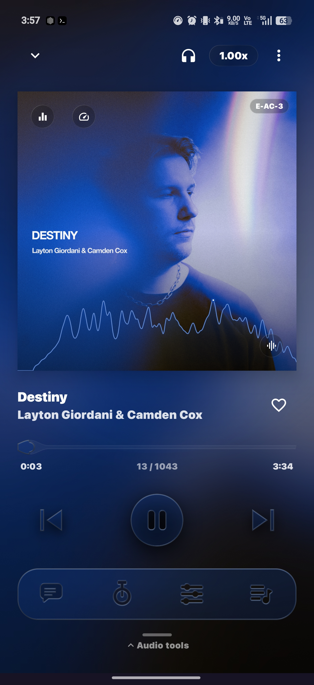
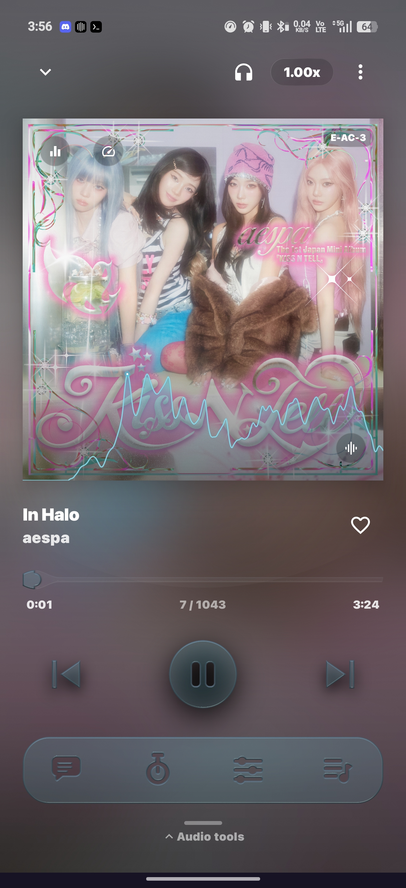
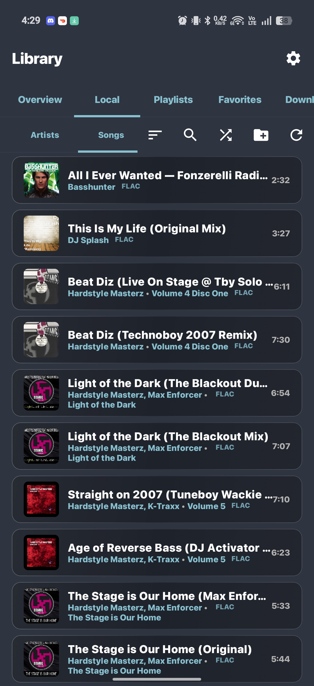
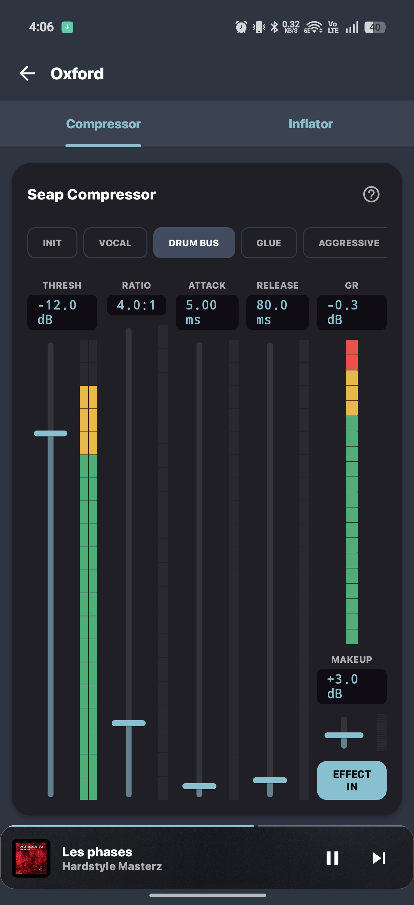
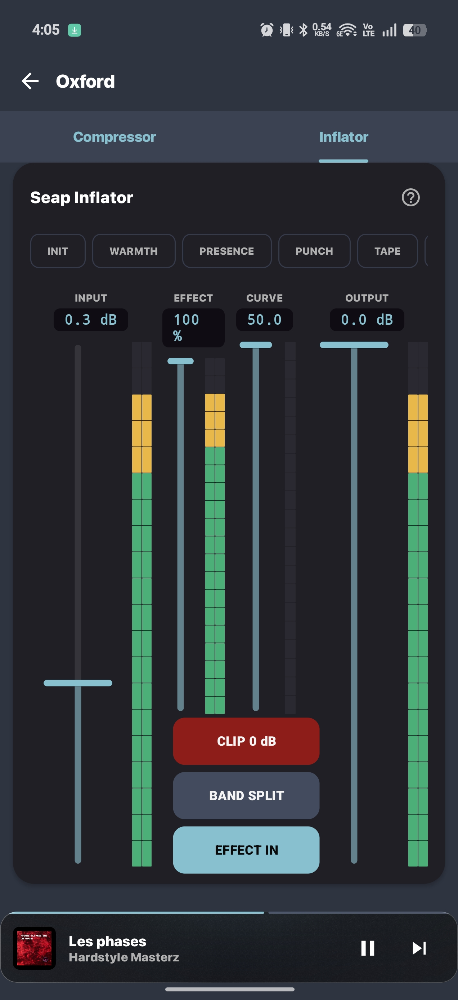
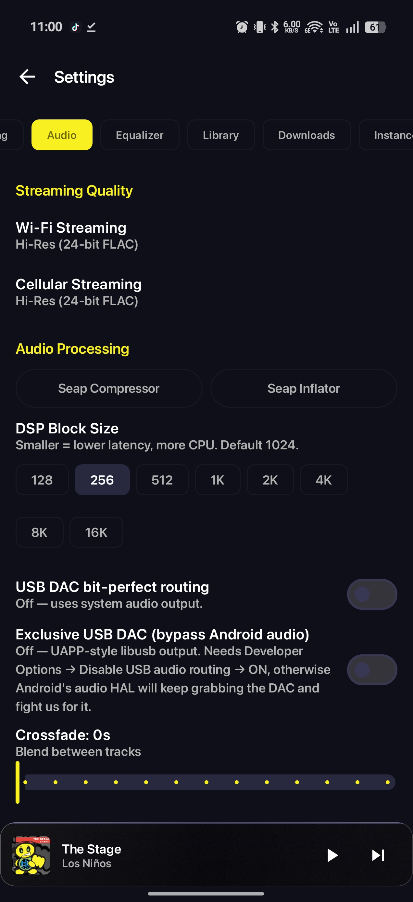

# Tryptify

> A native Android hi-fi music player: a C++17 DSP console, headphone AutoEQ from real measurements, bit-perfect USB-DAC output, and a player you can watch.

-3DDC84?logo=android&logoColor=white)


<p align="center">
  
  
  
</p>

Tryptify plays your local library and streams from TIDAL, Qobuz and Deezer. Every song says where it comes from, and every stage of the sound is yours to see and shape. Under the Compose / Material 3 interface sits a native signal-processing core:
- a mixing console of up to 48 buses with 36 C++ processors;
- a parametric AutoEQ built from published headphone measurements;
- a libusb driver that writes PCM straight to an external DAC, bypassing Android's audio stack.

<sub>Formerly **MonoTrypT**. The application id and on-device storage are unchanged, so existing installs upgrade in place.</sub>

---

## What's in it

- **One player for every source.** It plays the local library (FLAC, ALAC, WAV, MP3 and more) and streams from TIDAL, Qobuz and Deezer through the APIs you add under Settings › Connections. Tryptify detects which catalogs each server serves. Every result carries a pill naming its catalog, and the player says "via" when a song plays from another.
- **A glass nav bar.** Home, Library and Search are always there; the two buttons between them are your choice of Discover, World radio, Playlists, Local, Favorites or Downloads. Scroll down and the mini player folds into the bar.
- **A spectrum you can read.** A waterfall of the last few seconds of the song rises over the cover, in four styles: Lines, Ridgeline, Heat and Neon. Glass and Legacy are two single-line alternatives. Its analysis works like a studio analyser: Live average, Live max, Average or Max, with knobs for averaging time and overlap.
- **A DSP mixing console.** 4 to 48 buses plus master, up to 16 processors each, sends between buses, and a 9.1.6 Atmos upmix preset. The master strip carries EBU R128 loudness meters.
- **Headphone AutoEQ.** A 10-band parametric correction generated from more than 4,000 frequency-response measurements, against 10 target curves.
- **Bit-perfect USB DAC.** A UAC1 and UAC2 driver over libusb, with asynchronous-feedback pacing, a watchdog fallback and crossfades across sample rates.
- **Speed, pitch and tempo.** Two pitch engines (WSOLA and a phase vocoder), detected BPM, and a turntable-style tempo bend.
- **A MilkDrop visualizer.** projectM with 9,795 presets, as a hero view or an ambient layer behind the player. Every preset is crash-tested before it ships; see [The visualizer](#the-visualizer).
- **Seven languages.** English, Simplified Chinese, Japanese, French, Spanish, Turkish and German, chosen in Settings › Appearance › Language.
- **Everywhere else.** A home-screen widget, Android Auto, Discord presence, scrobbling, offline downloads and account sync of settings and library.

---

## Screenshots

| The player | |
| :---: | :---: |
|  |  |

| Now Playing | Audio tools |
| :---: | :---: |
|  |  |

| Library | AutoEQ |
| :---: | :---: |
|  |  |

| Compressor | Inflator |
| :---: | :---: |
|  |  |

| Settings | projectM visualizer |
| :---: | :---: |
|  |  |

What changed in each version: [release notes](docs/releases/1.9.2.md).

---

## DSP mixer

The core is a C++17 native library (`monochrome_dsp`) inside the ExoPlayer audio pipeline. It uses three techniques to keep the real-time audio thread from ever blocking on the UI:
- ARM NEON SIMD;
- denormal flush-to-zero;
- lock-free atomic hand-off of parameter changes.

```
ExoPlayer → AutoEQ / ParamEQ → MixBusProcessor (JNI) → projectM tap → AudioSink
                                     │                                     │
                               Native DspEngine            ┌───────────────┴───────────────┐
                               ├─ Bus 1 … Bus N (4–48)     │ default → DefaultAudioSink     │
                               │   up to 16 processors     │ bypass  → LibusbAudioSink      │
                               │   sends to other buses    │           (libusb UAC1/UAC2)   │
                               ├─ Sum ─────────────┐       └────────────────────────────────┘
                               └─ Master ──────────┘  up to 16 processors, EBU R128 meter
```

**Buses:** each has gain, pan, mute, solo, input enable and sends to any other bus; a cable that would close a loop is refused. **Master:** sums the buses, runs its own chain, and meters peak, hold and loudness. Engine state serialises to JSON and persists in Room.

### The 36 processors

| Category | Processors |
| --- | --- |
| **Utility** | Gain · Stereo (M/S, equal-power pan) · Channel Mixer · Haas |
| **EQ and filter** | 3-Band EQ · 10-Band EQ · Filter (RBJ biquad, 1×–4× slope) · Comb · Formant · Ladder (2× OS) · Nonlinear (SVF + shapers) · Resonator |
| **Dynamics** | Compressor · Limiter (lookahead, true peak) · Gate · Dynamics · Compactor · Transient Shaper · Trance Gate |
| **Distortion** | Distortion · Misstortion · Shaper (transfer LUT) · Bitcrush (TPDF dither) · Phase Distortion |
| **Modulation** | Chorus · Ensemble · Flanger · Phaser · Ring Mod · Tape Stop · Frequency Shifter · Pitch Shifter · Disperser |
| **Space** | Delay (ping-pong, ducking) · Reverb (FDN) · Reverser |

Every processor has bypass, dry/wet, and parameter smoothing. Setters clamp their inputs and reject non-finite values before they reach the audio thread, and a biquad given impossible coefficients passes audio through rather than producing NaNs.

The Oxford-style **Inflator** and **Compressor** have screens of their own, outside the bus chains.

---

## AutoEQ

A 10-band parametric EQ generated from frequency-response measurements. The algorithm is greedy, finding one peak at a time:

1. Normalise the measurement against the target over 250–2500 Hz.
2. Find the worst deviation between 20 Hz and 16 kHz, with errors below 50 Hz weighted 1.2×.
3. Invert it into a filter: gain clamped to ±12 dB (±8 dB above 8 kHz), Q estimated from the deviation's bandwidth.
4. Subtract that filter's response from the remaining error.
5. Repeat for up to 10 bands, stopping early once the largest error is under 0.05 dB.

**Targets:** Harman Over-Ear 2018, Harman In-Ear 2019, Diffuse Field, Knowles, Moondrop VDSF and Flat, plus house targets.

**Measurements:** twelve squig.link instances are queried in parallel, and the AutoEq catalog is bundled with the app. Each measurement is tagged with the rig that captured it, and the list filters by rig instantly. You can also import your own measurements as CSV or TXT.

---

## USB-DAC bit-perfect output

A libusb Audio Class driver takes the DAC's streaming interface from the kernel and writes PCM straight to its isochronous endpoint, past the Android audio HAL.

- **Negotiation:** UAC1 and UAC2 are detected from the descriptors. Sample rates are resolved through the UAC2 clock entities, and alternate settings that can't carry the rate are rejected up front.
- **Pacing:** UAC2 asynchronous feedback when the DAC offers it, fixed-rate pacing otherwise.
- **Sink integration:** `LibusbAudioSink` runs the same processor chain as the normal path, then writes the post-DSP PCM to libusb. If the iso pump stalls, a watchdog falls back to the system sink, so playback never dead-ends.
- **Errors you can act on:** start failures are sorted into causes (no device, no matching alternate setting, claim failed, sample rate failed and so on) and shown in Settings.

---

## The visualizer

projectM 4.1.6 renders 9,795 MilkDrop presets from the "Cream of the Crop" pack, fed from the post-DSP audio. It runs as a hero view in place of the cover, or as an ambient layer composited into the player's background on the GPU.

- **A patched projectM.** projectM 4.1.6 crashed on the first frame of any preset that samples a texture the app doesn't ship. The fix lives in [`app/src/main/cpp/projectm_patches/`](app/src/main/cpp/projectm_patches/) and is swapped into projectM's build without touching the submodule.
- **Every preset is crash-tested.** [`tools/preset_crash_scan/`](tools/preset_crash_scan/) runs all 9,795 presets through the same patched projectM under AddressSanitizer on a headless GLES context. With the patch, none crash or hang.
- **Device crashes are flagged.** A preset that crashes one phone's GPU driver is caught on that phone: the app records each preset before loading it, and the next launch flags whichever was on screen when the process died. Flagged presets are skipped and marked in the browser.

---

## Architecture

One app module, package `tf.monochrome.android`.

```
tf.monochrome.android/
├── audio/
│   ├── dsp/         # MixBusProcessor (JNI), DspEngineManager, Oxford effects
│   ├── eq/          # AutoEQ engine, parametric EQ, spectrum analyser tap
│   ├── atmos/       # Atmos renderer and upmix
│   ├── stretch/     # Speed and pitch engines
│   ├── tempo/       # BPM detection
│   ├── usb/         # libusb UAC driver, sink, exclusive-mode controller
│   └── pipeline/    # The Audio Pipeline panel's view of every stage
├── data/            # APIs, Room, DataStore, downloads, local scanner, sync, presence
├── domain/          # Models and use cases
├── player/          # Media3 PlaybackService, queue, stream resolver, crossfade
├── radio/           # Local radio planner
├── ui/              # Compose screens: player, library, discover, mixer, eq, settings …
├── visualizer/      # projectM engine, renderer views, preset browser data
├── auto/            # Android Auto media browser
└── widget/          # Glance home-screen widget
```

```
app/src/main/cpp/
├── dsp/             # DSP engine, 36 snapins, meters, scope, WSOLA, host tests
├── atmos/           # Atmos renderer, host tests
├── stretch/         # Pitch/time engines
├── usb/             # libusb UAC1/UAC2 driver
├── projectm_bridge.{h,cpp}, projectm_jni.cpp
└── projectm_patches/   # Crash fixes swapped into projectM's build
```

Native code is built with `-O3`, NEON and denormal flush-to-zero, for `arm64-v8a`, `armeabi-v7a` and `x86_64`. Persistence is Room (schema v14) for library, history, playlists, downloads and presets, plus DataStore for settings.

---

## Tech stack

| Component | Version |
| --- | --- |
| Language | Kotlin 2.1.0 (KSP 2.1.0-1.0.29) |
| Build | Android Gradle Plugin 9.0.0 · compile/target SDK 36 · min SDK 26 |
| UI | Jetpack Compose (BOM 2025.07.00) · Material 3 · Haze 1.7.1 |
| Audio | Media3 / ExoPlayer 1.5.1 |
| DSP | C++17 via JNI (`monochrome_dsp`) |
| USB | libusb 1.0 (UAC1 + UAC2) |
| Visualizer | projectM 4.1.6, patched |
| DI · storage | Hilt 2.57.1 · Room 2.7.1 · DataStore |
| Network · images | Ktor 3.0.3 · Coil 3.0.4 |
| Sync | Supabase |

---

## Building

**Requirements:** Android Studio, JDK 17, and the Android NDK and CMake from the SDK Manager. libusb and projectM are git submodules under `third_party/`; projectM has a nested one, so fetch them recursively.

```bash
git clone --recursive https://github.com/tryptz/Tryptify.git
cd Tryptify
# or, in an existing clone:
git submodule update --init --recursive

./gradlew assembleDebug          # build
./gradlew installDebug           # install on a connected device
./gradlew :app:testDebugUnitTest # unit tests
app/src/main/cpp/dsp/tests/run_host_tests.sh   # native DSP tests, no device needed
```

For release builds, copy `keystore.properties.example` to `keystore.properties` and fill in your signing config. Prebuilt APKs are on the [Releases page](https://github.com/tryptz/Tryptify/releases/latest) (Android 8.0+).

Translations are edited in [`app/l10n/strings.tsv`](app/l10n/strings.tsv) and written into every language by `app/l10n/generate_strings.py`.

Contributors and coding agents should read [`AGENTS.md`](AGENTS.md) first. It links the UI rules ([`docs/ui-invariants.md`](docs/ui-invariants.md)) and the per-area playbooks.

---

## Reliability

- **Real-time safety:** DSP setters clamp and reject non-finite input before the audio thread sees it.
- **No dead ends:** the USB watchdog falls back to the system sink; a crashing visualizer preset is fixed at the source, or flagged and skipped.
- **Errors that say something:** USB start-up failures map to specific causes shown in Settings.
- **Isolated failures:** a dead measurement host or a broken tag is logged and dropped without stopping playback.

---

## Author

Built by **[tryptz](https://github.com/tryptz)**.
