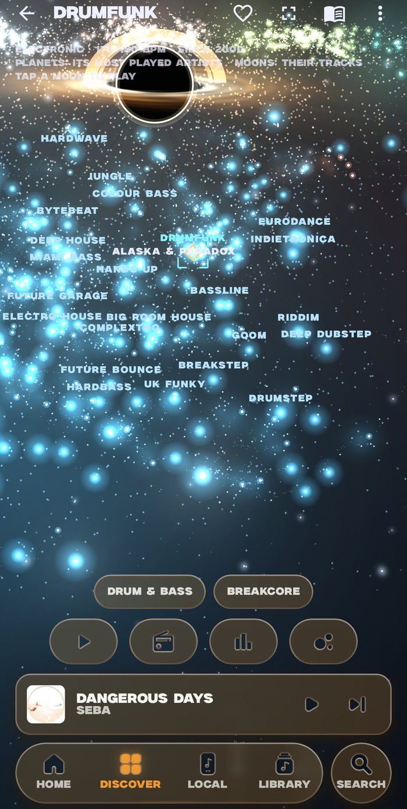
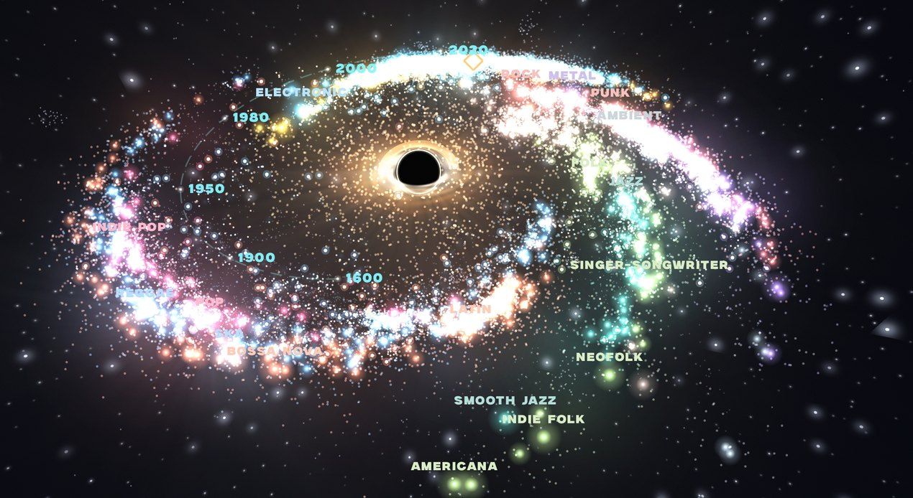
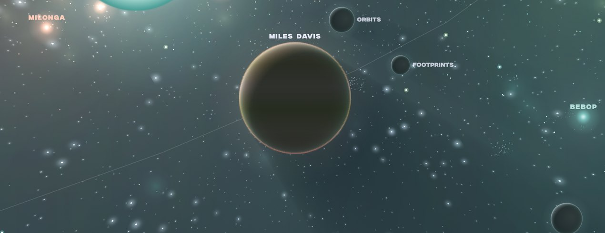
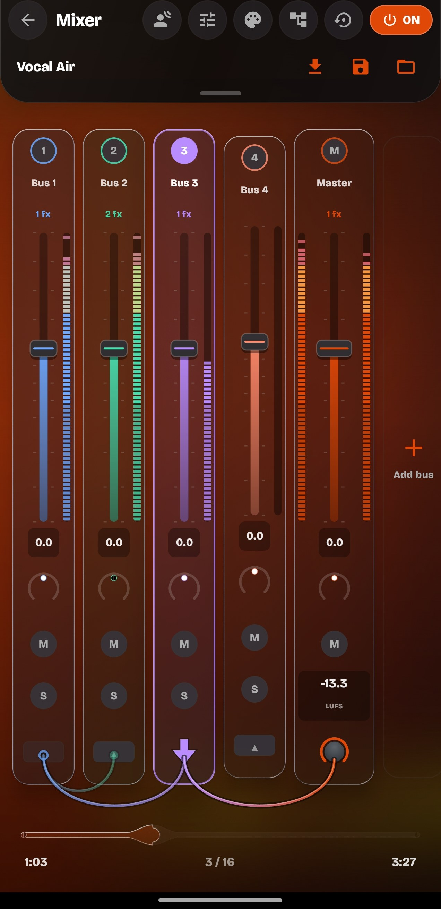
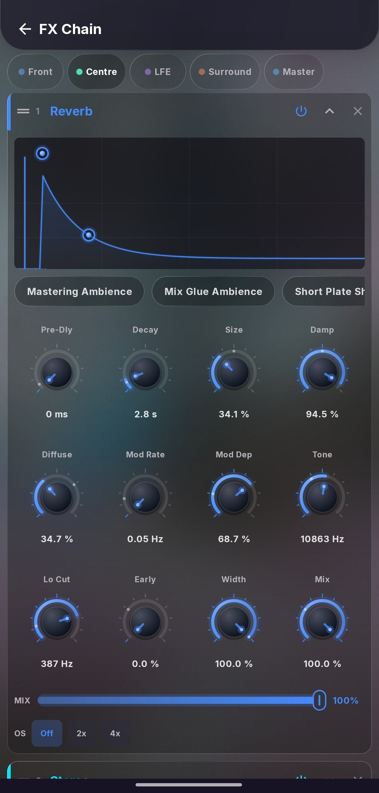
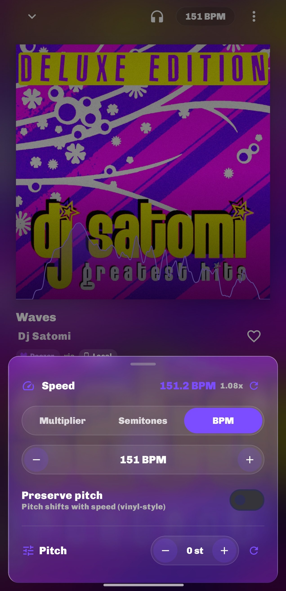
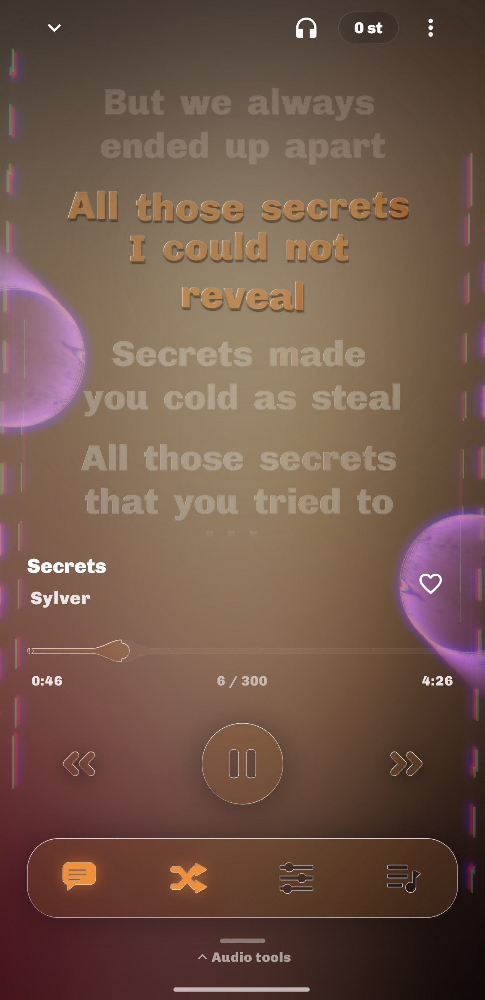
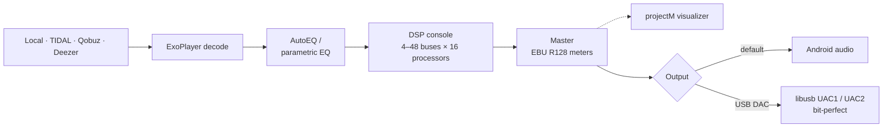

# Tryptify

> A native Android hi-fi music player: a C++17 DSP console, headphone AutoEQ from real measurements, bit-perfect USB-DAC output, liquid glass, lyrics lit by god rays, and every genre in music as a galaxy you can fly through.

[](https://github.com/tryptz/Tryptify/releases)
[](https://github.com/tryptz/Tryptify/releases/latest)
-3DDC84?logo=android&logoColor=white)


<p align="center">
  <a href="https://github.com/tryptz/Tryptify/releases/latest/download/tryptify.apk"><b>⬇ Download the latest APK</b></a>
  &nbsp;·&nbsp;
  <a href="https://github.com/tryptz/Tryptify/releases/latest">Release notes</a>
  <br>
  <sub>Android 13+ · formerly <b>MonoTrypT</b>, existing installs upgrade in place</sub>
</p>

## New in 1.9.3

### Lyrics in god rays

<table>
  <tr>
    <td rowspan="3"></td>
    <td></td>
  </tr>
  <tr>
    <td></td>
  </tr>
  <tr>
    <td></td>
  </tr>
</table>

Light streams from the line being sung, or from behind it through the letters, and follows the word as it is sung. The letters can be any glass, so they catch the light. Aim the rays, add dust, a beat flare, an orbit, sway or tilt, or start from one of nine looks (Sunburst, Cathedral, Eclipse, Daybreak, Searchlight, Spotlight, Crepuscular, Mercury, Sea Glass) in Player Visuals Studio › Lyrics.

### Every genre as a galaxy

<table>
  <tr>
    <td rowspan="2"></td>
    <td></td>
  </tr>
  <tr>
    <td></td>
  </tr>
</table>

All 771 genres are stars in 3D around a black hole, with god rays and gas that moves with the music. Lay it out by family, or as a timeline spiral with the oldest music at the core. Stop on a genre and its most-played artists orbit it as planets, their tracks as moons: tap a moon to play it. Long-press a star to play the genre, and turn the phone sideways for full screen.

### Liquid glass

<p align="center">
  
</p>

The mini player, nav bar, search bars, panels and every pill bend what is behind their edges, like real glass, and stay clear across the middle. Pick from Float, Opal, Ripple, Glint and more, or tune your own. Text on glass reads on the glass: light on dark glass, dark on light. Low performance mode draws it all flat.

## More screenshots

<table>
  <tr>
    <td colspan="3" align="center">
      
      <br>
      <b>Glass spectrum</b>: a single glass line over the cover, the visualizer behind.
    </td>
  </tr>
  <tr>
    <td width="33%" valign="top">
      
      <b>Ridgeline spectrum</b> over the cover, with the ambient visualizer.
    </td>
    <td width="33%" valign="top">
      
      <b>Waterfall spectrum</b> on a streamed track.
    </td>
    <td width="33%" valign="top">
      
      <b>Home</b> with source pills, the mini player and the glass nav bar.
    </td>
  </tr>
  <tr>
    <td width="33%" valign="top">
      
      <b>Mixer</b> buses with faders, meters, routing and LUFS.
    </td>
    <td width="33%" valign="top">
      
      <b>FX Chain</b>: a reverb with its decay graph and presets.
    </td>
    <td width="33%" valign="top">
      
      <b>Add Plugin</b>: the processors by category.
    </td>
  </tr>
  <tr>
    <td width="33%" valign="top">
      
      <b>Speed and pitch</b> by multiplier, semitones or BPM.
    </td>
    <td width="33%" valign="top">
      
      <b>Lyrics</b>, synced line by line.
    </td>
    <td width="33%" valign="top">
      
      <b>AutoEQ</b>: headphone correction from measurements.
    </td>
  </tr>
</table>

## What's in it

| | |
| --- | --- |
| **Every source in one player** | Local FLAC, ALAC, WAV (16/24-bit and 32-bit float), MP3, AAC and Ogg/Opus through Media3 ExoPlayer 1.5.1, with a bundled FFmpeg renderer for codecs Android lacks. TIDAL up to 24-bit FLAC, Qobuz, and Deezer as FLAC or MP3 320, from the servers you add in Settings › Connections. Every result names its catalog, and each service streams and downloads in a quality of its own. Downloads are tagged FLAC with the cover embedded, filed as Artist / Album / Track, and Dolby Atmos mixes from TIDAL download as .m4a. |
| **Discover** | Today's discovery: one new genre a day, next to the ones you play. Swipe to discover: 15 songs a day, one card at a time, right to keep and left to skip. A release radar of new albums from the artists you play most. A switch for whether all of it comes from TIDAL, Qobuz or Deezer. |
| **The genre galaxy** | 771 genres from a researched genre graph, the documented ones with their history. Two layouts (by family, or a timeline spiral from 1600 to now), planets from each genre's chart, a music-reactive gas shader, and a Look sheet for the sky, core, rays, motion and stars. It stops completely when it is out of sight, and low performance mode drops the heavy effects. |
| **Lyrics** | Every source asked at once (TIDAL, LRCLib, NetEase, Kugou, lrc.red, LyricsPlus and the AMLL library), with word-by-word karaoke timing preferred over line timing. They stay in time at any playback speed, Bluetooth delay included, and go up to 64 sp without splitting a word. God rays, glass letters and nine looks on top. |
| **Liquid glass** | A shader that bends what is behind each surface's rounded edge, on the mini player, nav bar, search bars, panels, sheets and every pill, all tuned from one set of sliders in Player Visuals Studio. Over twenty themes, drop shadows, and a flat fallback for low performance mode. |
| **A spectrum you can read** | A 4,096, 8,192 or 16,384-point FFT reduced to 256 display bins, drawn as a C++ waterfall in one pass: Lines, Ridgeline, Heat or Neon, or single-line Glass and Legacy. Live average, Live max, Average or Max analysis with adjustable averaging time and overlap. Frame-rate cap from 15 to 120 fps or every refresh, with optional vsync. |
| **DSP mixing console** | A C++17 engine inside ExoPlayer's audio pipeline: NEON SIMD, denormal flush-to-zero, lock-free parameter hand-off. 4–48 buses plus master, up to 16 of 36 processors each, sends between any buses (loops refused), per-plugin oversampling off/2×/4× capped at 192 kHz. A 9.1.6 upmix preset; EBU R128 momentary, short-term, integrated, loudness range and true peak. |
| **Headphone AutoEQ** | A 3 to 31-band parametric correction (10 by default), fitted greedily to the worst deviation from 20 Hz to 16 kHz, ±12 dB (±8 dB above 8 kHz). 4,000+ measurements from 12 squig.link sources and the bundled AutoEq catalog, against 10 targets including Harman Over-Ear 2018, Harman In-Ear 2019, Diffuse Field and Moondrop VDSF. Peaking or shelf ends, smoothing, automatic preamp, separate left/right calibration, and CSV/TXT import. |
| **Bit-perfect USB DAC** | A libusb UAC1/UAC2 driver claims the DAC's streaming interface and writes 16, 24 or 32-bit PCM to its isochronous endpoint, past Android's mixer, at any rate the DAC exposes. UAC2 asynchronous feedback paces it; a watchdog falls back to the system output if the stream stalls. Crossfades work across sample rates. The DAC gets a volume of its own, on the player and the volume keys, in click-free 2 dB steps, and full volume stays bit-perfect. |
| **Speed, pitch, tempo** | 0.25× to 3.0×, set as a multiplier, in semitones at exact 2^(n/12) ratios, or in BPM. Two pitch engines: a phase vocoder (signalsmith-stretch) for melodic material and WSOLA for drums. Tempo is measured once per track from a 200 Hz onset envelope, autocorrelated between 60 and 200 BPM with a 120 BPM prior; a turntable-style bar bends it. |
| **MilkDrop visualizer** | projectM 4.1.6 on OpenGL ES 3.0 with 9,795 presets in one packed archive, patched for a crash on missing textures. Every preset is run under AddressSanitizer on a headless GLES context before it ships, and one that crashes a phone's GPU driver is flagged from the exit record and skipped. Runs as the hero view or as an ambient layer. |
| **Radio** | Pick Familiar, Balanced or Adventurous, then three dials (songs you know to songs you haven't heard, close to the song to further out, loose to same genre and era) and three switches: prefer my library, avoid songs I just heard, prefer original versions. |
| **Playlists that fix themselves** | Repair relinks songs whose stored id plays a different song. Regenerate finds every song again on TIDAL, Qobuz or Deezer, matched by title, artist, version and length, never a search's first hit. Downloaded songs and songs with no sure match are never touched. |
| **Your fonts** | A font browser that draws each font in its own letters and previews it on your own text. Imports are checked as real fonts before they are kept, and are named after the font, so one never overwrites another. |
| **Seven languages** | English, 简体中文, 日本語, Français, Español, Türkçe and Deutsch, generated from one translation table, with Settings search in every language and Android 13's per-app language setting. |
| **Everywhere else** | A Glance home-screen widget, Android Auto, Discord presence, Last.fm and ListenBrainz scrobbling, offline downloads, and Supabase sync of settings, library and presets. |

## How the sound flows


```mermaid
flowchart LR
    S["Local · TIDAL · Qobuz · Deezer"] --> X["ExoPlayer decode"]
    X --> EQ["AutoEQ /<br/>parametric EQ"]
    EQ --> M["DSP console<br/>4–48 buses × 16 processors"]
    M --> MA["Master<br/>EBU R128 meters"]
    MA -.-> V["projectM visualizer"]
    MA --> O{"Output"}
    O -->|default| A["Android audio"]
    O -->|USB DAC| U["libusb UAC1 / UAC2<br/>bit-perfect"]
```

The DSP runs in a native C++17 library inside ExoPlayer's audio pipeline. Parameter changes reach the audio thread through lock-free atomics, so the UI can never block playback. NEON SIMD and denormal flush-to-zero keep each buffer cheap.

### The 36 processors

| Category | Processors |
| --- | --- |
| **Utility** | Gain · Stereo · Channel Mixer · Haas |
| **EQ & Filter** | Filter · 3-Band EQ · 10-Band EQ · Comb · Formant · Ladder · Nonlinear · Resonator · Disperser |
| **Dynamics** | Compressor · Limiter · Gate · Dynamics · Compactor · Transient Shaper · Trance Gate |
| **Distortion** | Distortion · Misstortion · Shaper · Bitcrush · Phase Distortion |
| **Modulation** | Chorus · Ensemble · Flanger · Phaser · Ring Mod · Tape Stop · Frequency Shifter · Pitch Shifter |
| **Space** | Delay · Reverb · Reverser |

Each has bypass, dry/wet and parameter smoothing. Out-of-range and non-finite values are rejected before they reach the audio thread.

## Building

Needs Android Studio, JDK 17, and the NDK and CMake from the SDK Manager. libusb and projectM are submodules; projectM has a nested one, so clone recursively.

```bash
git clone --recursive https://github.com/tryptz/Tryptify.git
./gradlew assembleDebug                      # build
./gradlew :app:testDebugUnitTest             # unit tests
app/src/main/cpp/dsp/tests/run_host_tests.sh # native DSP tests, no device needed
```

Release builds read their signing config from `keystore.properties` (see `keystore.properties.example`). Translations live in [`app/l10n/strings.tsv`](app/l10n/strings.tsv). Contributors and coding agents start at [`AGENTS.md`](AGENTS.md). What changed in each version: [release notes](docs/releases/1.9.3.md) and [CHANGELOG](CHANGELOG.md).

Built by **[tryptz](https://github.com/tryptz)**.
