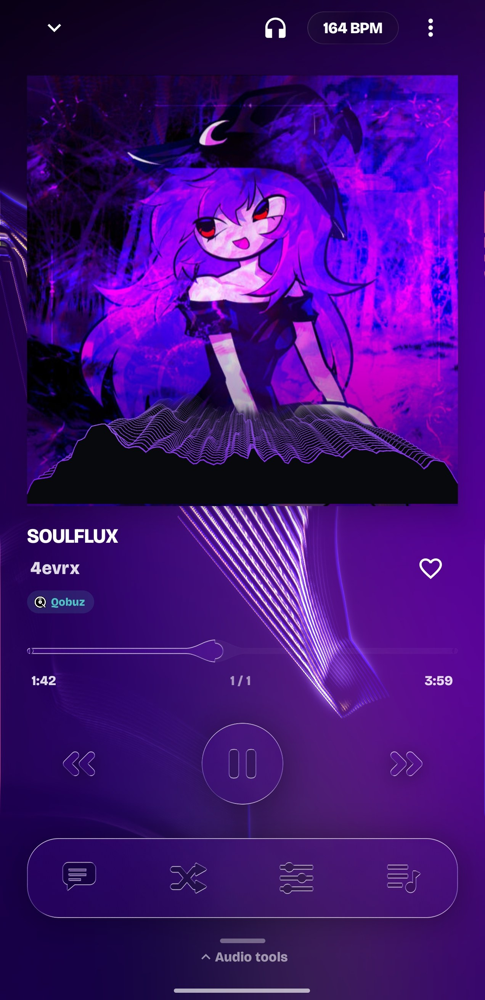
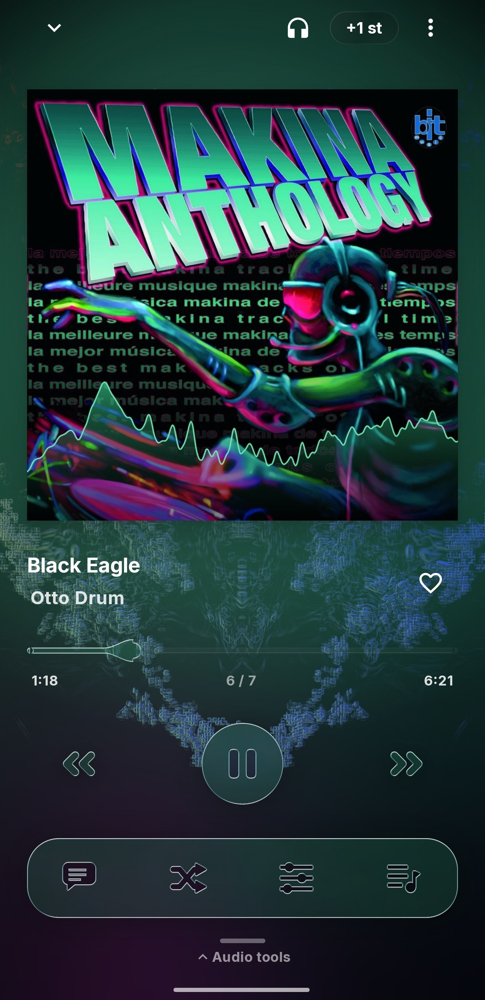
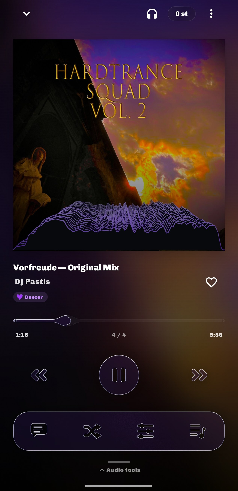
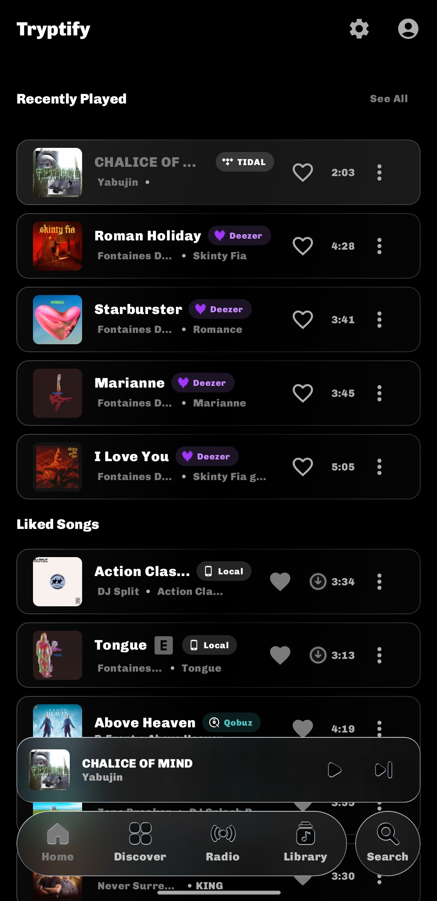
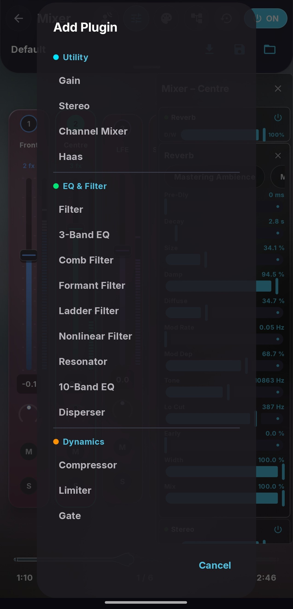
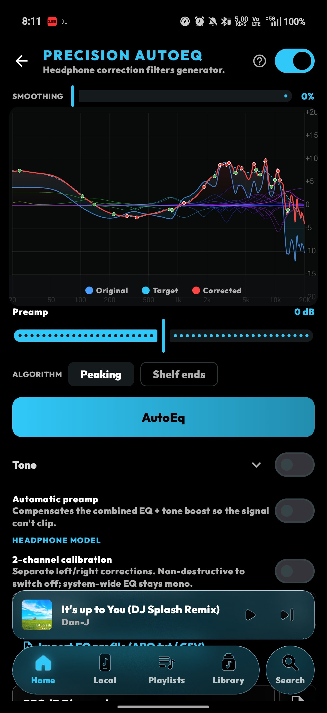
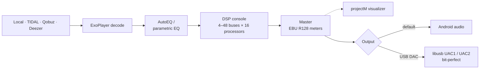

# Tryptify

> A native Android hi-fi music player: a C++17 DSP console, headphone AutoEQ from real measurements, bit-perfect USB-DAC output, and a player you can watch.

[](https://github.com/tryptz/Tryptify/releases)
[](https://github.com/tryptz/Tryptify/releases/latest)
-3DDC84?logo=android&logoColor=white)


<p align="center">
  <a href="https://github.com/tryptz/Tryptify/releases/latest/download/tryptify.apk"><b>⬇ Download the latest APK</b></a>
  &nbsp;·&nbsp;
  <a href="https://github.com/tryptz/Tryptify/releases/latest">Release notes</a>
  <br>
  <sub>Android 8.0 or newer · formerly <b>MonoTrypT</b>, existing installs upgrade in place</sub>
</p>

<table>
  <tr>
    <td width="33%" valign="top">
      
      <b>Ridgeline spectrum + ambient visualizer.</b> The last few seconds of the song rise over the cover as stacked ridges. Behind the player, a MilkDrop preset runs as an ambient layer. The pill under the artist names the catalog, here Qobuz.
    </td>
    <td width="33%" valign="top">
      
      <b>Glass spectrum.</b> The single-line style: one refractive line across the cover instead of a waterfall. <code>+1 st</code> in the top bar means the song is pitched up one semitone; the four buttons below open lyrics, shuffle, the mixer and the queue.
    </td>
    <td width="33%" valign="top">
      
      <b>Waterfall on a stream.</b> The same player on a Deezer track. Every song carries its source, and the player says "via" when it plays from a different catalog than the one it was found in.
    </td>
  </tr>
  <tr>
    <td valign="top">
      
      <b>Home and the glass nav bar.</b> Recently played and liked songs from four sources at once. The mini player folds into the nav bar on scroll. Home, Library and Search are fixed; the two buttons between them are your choice.
    </td>
    <td valign="top">
      
      <b>The DSP console.</b> Buses named for a surround layout (Front, Centre, LFE), the Centre bus running a reverb preset, and the Add Plugin sheet open over it. Every one of the 36 processors is native C++.
    </td>
    <td valign="top">
      
      <b>Headphone AutoEQ.</b> Your headphone's measured response (Original) and the Target, with the generated 10-band correction applied (Corrected). Here the nav bar has Local and Playlists in its two free slots.
    </td>
  </tr>
</table>

## What's in it

| | |
| --- | --- |
| 🎧 **Every source in one player** | Local files (FLAC, ALAC, WAV, MP3 …) plus TIDAL, Qobuz and Deezer streams through the servers you add in Settings › Connections. |
| 📈 **A spectrum you can read** | Waterfall styles Lines, Ridgeline, Heat and Neon, or single-line Glass and Legacy. Analysis modes: Live average, Live max, Average and Max. |
| 🎛️ **DSP mixing console** | 4–48 buses plus master, up to 16 processors each, sends between buses, a 9.1.6 Atmos upmix preset and EBU R128 loudness meters. |
| 📐 **Headphone AutoEQ** | A 10-band parametric correction from 4,000+ measurements against 10 target curves, or your own CSV/TXT. |
| 🔌 **Bit-perfect USB DAC** | A UAC1/UAC2 driver over libusb writes PCM straight to the DAC, past Android's mixer, and falls back to the system output if it stalls. |
| ⏩ **Speed, pitch, tempo** | Two pitch engines (WSOLA and a phase vocoder), detected BPM, and a turntable-style tempo bend. |
| 🌌 **MilkDrop visualizer** | projectM with 9,795 presets, every one crash-tested under AddressSanitizer before it ships. Runs as the hero view or as an ambient layer. |
| 🌍 **Seven languages** | English, 简体中文, 日本語, Français, Español, Türkçe, Deutsch. |
| 📱 **Everywhere else** | Home-screen widget, Android Auto, Discord presence, scrobbling, offline downloads, account sync. |

## How the sound flows


```mermaid
flowchart LR
    S["Local · TIDAL · Qobuz · Deezer"] --> X["ExoPlayer decode"]
    X --> EQ["AutoEQ /<br/>parametric EQ"]
    EQ --> M["DSP console<br/>4–48 buses × 16 processors"]
    M --> MA["Master<br/>EBU R128 meters"]
    MA -.-> V["projectM visualizer"]
    MA --> O{"Output"}
    O -->|default| A["Android audio"]
    O -->|USB DAC| U["libusb UAC1 / UAC2<br/>bit-perfect"]
```

The DSP runs in a native C++17 library inside ExoPlayer's audio pipeline. Parameter changes reach the audio thread through lock-free atomics, so the UI can never block playback. NEON SIMD and denormal flush-to-zero keep each buffer cheap.

### The 36 processors

| Category | Processors |
| --- | --- |
| **Utility** | Gain · Stereo · Channel Mixer · Haas |
| **EQ & Filter** | Filter · 3-Band EQ · 10-Band EQ · Comb · Formant · Ladder · Nonlinear · Resonator · Disperser |
| **Dynamics** | Compressor · Limiter · Gate · Dynamics · Compactor · Transient Shaper · Trance Gate |
| **Distortion** | Distortion · Misstortion · Shaper · Bitcrush · Phase Distortion |
| **Modulation** | Chorus · Ensemble · Flanger · Phaser · Ring Mod · Tape Stop · Frequency Shifter · Pitch Shifter |
| **Space** | Delay · Reverb · Reverser |

Each has bypass, dry/wet and parameter smoothing. Out-of-range and non-finite values are rejected before they reach the audio thread.

## Building

Needs Android Studio, JDK 17, and the NDK and CMake from the SDK Manager. libusb and projectM are submodules; projectM has a nested one, so clone recursively.

```bash
git clone --recursive https://github.com/tryptz/Tryptify.git
./gradlew assembleDebug                      # build
./gradlew :app:testDebugUnitTest             # unit tests
app/src/main/cpp/dsp/tests/run_host_tests.sh # native DSP tests, no device needed
```

Release builds read their signing config from `keystore.properties` (see `keystore.properties.example`). Translations live in [`app/l10n/strings.tsv`](app/l10n/strings.tsv). Contributors and coding agents start at [`AGENTS.md`](AGENTS.md). What changed in each version: [release notes](docs/releases/1.9.2.md) and [CHANGELOG](CHANGELOG.md).

Built by **[tryptz](https://github.com/tryptz)**.
