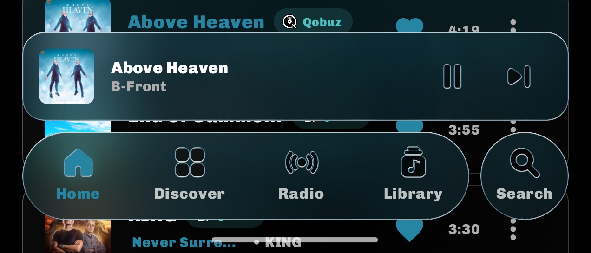
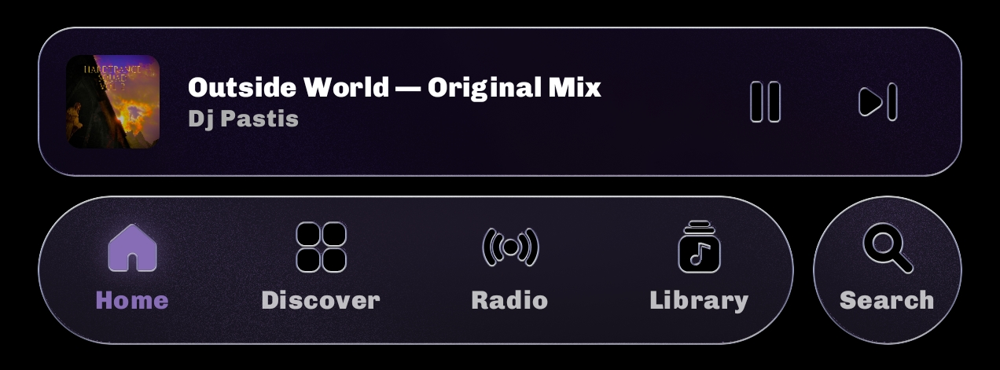
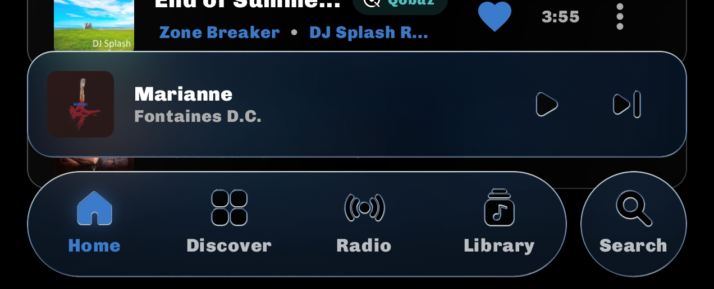

# Tryptify 1.9.2

A new way around the app, a spectrum you can watch the last few seconds of the
song in, real loudness metering, and Deezer — plus a lighter player that spends
less of your battery on frames nobody can see.

---

## ✨ Highlights

### 🏔️ Spectrum waterfall
The spectrum on the album art now falls back in time. The bright line at the
front is what you hear now; every moment a copy of it recedes, rises and fades,
so the last few seconds of the song stand behind it like a mountain range.

- **Four styles** — *Lines*, *Ridgeline*, *Heat* and *Neon*.
- **Shape it your way** — depth, fade start, angle and line weight, from bold
  bands to fine hairlines.
- **Touch to tune** — in the Studio's preview, drag up and down for the angle,
  left and right for the depth, pinch for line weight, and grab the fade line to
  move where it starts.
- **Frame rate & Vsync** — cap it anywhere from 15 to 120 fps or leave it on
  Max. Vsync keeps frames evenly spaced; turn it off to hit the exact rate.
- **Previews even with nothing playing**, on a built-in demo signal.

### 📏 LUFS meters
Broadcast-standard loudness (EBU R128) for what Tryptify actually sends out.

- **Audio Pipeline panel** — Momentary, Short-term, Integrated, Loudness Range
  and True Peak, in a new Loudness stage.
- **Mixer master strip** — Short-term and Integrated at a glance. Tap to restart
  Integrated.
- Runs only while a readout is on screen, and starts over with each new track.

### 🧭 A new way around
- **Glass tab bar** for Home, Discover, Radio, Library and Search. Scroll down and
  the mini player folds into it; scroll up and it comes back.
- **New Home, Library and Search** — Recently Played and Liked Songs on Home,
  Library sections on chips, and Search as its own page.

| | | |
|:---:|:---:|:---:|
|  |  |  |

The tab bar and mini player are one sheet of glass, tinted by whatever is playing.

### 🎧 Deezer
Search Deezer's songs, albums and artists, and play and download them in full —
FLAC or MP3 320.

---

## 🎛️ Player & visuals
- **Wave Candy** — an FL Studio-style oscilloscope on the cover, stereo or mono,
  neon or shadow.
- **Kick punch** — the cover jumps on every kick drum.
- **Glass preset browser in Settings** — *Default Preset* now opens the same
  browser as the player: categories, authors, favourites and search across all
  9,795 presets, with an Auto option and your current pick on top.
- **Lighter player** — the spectrum no longer redraws the whole player every
  frame, it rests when playback pauses, the glass stops polling the tilt sensor
  when nothing uses it, and only one settings preview runs at a time.
- **Search button** presses with the same glass dome as the other tabs.

## 🔎 Search & sources
- **Source tags everywhere** — every song, album and artist shows its catalog,
  and the player says *via* when it plays from another.
- **One list of APIs** — add a server once and Tryptify finds out which catalogs
  it serves.
- **Cleaner search** — source filters cover every result type, and albums open
  from their own catalog.
- **TIDAL asks before Qobuz** — when TIDAL can't play a song, you choose.

## 🎚️ Mixer & audio
- **Route any bus to any bus**, up to 48, with cables and send knobs.
- **Atmos Upmix 9.1.6** — spreads stereo into 9.1.6 surround.
- **Mastering-style presets** — master at 0 dB with a limiter last.
- **Crossfades on a USB DAC**, across sample rates, and smoother crossfades
  everywhere.

## ⏱️ Speed
- **BPM detection** — set speed in BPM, multiplier or semitones.
- **Turntable bend** — push the bar under the BPM to bend the tempo, with a click
  per beat. Long-press the BPM to type one.
- **Clearer speed panel**.

## 📁 Library
- **Better WAVs** — float and 8-bit files play right, tags and covers show, rows
  say *WAV 24/48*, and *Artist ~ Title* names fill in the artist.
- **Steadier navigation** — a fast double back no longer blanks the screen.

---

## 👋 Removed
- **Nightcore button** — use 1.10× with *Preserve pitch* off.
- **Catalog picker and URL fields** — replaced by the API list.
