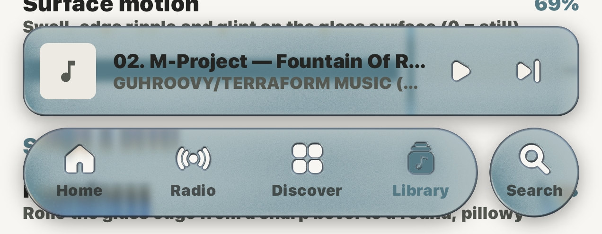
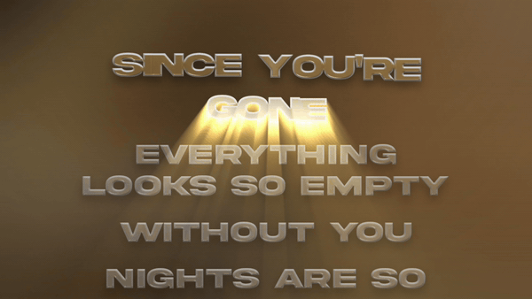

# Tryptify 1.9.3

Liquid glass across the app, god rays on the lyrics, and TIDAL working properly again. Downloads are filed by artist and album, Dolby Atmos mixes can be downloaded, USB DACs get a volume of their own, and your plays reach your account.

Each change is marked New, Changed or Fixed.

## Look and feel

- New: **Liquid glass.** The mini player, nav bar, search bars and panels bend what is behind their edges, like real glass.
- New: **Glass themes**: Float, Opal, Ripple, Glint, Blurred and Frosted Ripple, tuned on device, then Clear, Tinted, Tilt, Pure, Droplet, Prism, Bubble, Mercury, Ice, Halo, Aurora, Dusk and Holo, in Player Visuals Studio. Float is the new starting look; glass you tuned yourself is kept.
- New: **Shadows under the bars**, matching the play button's.
- Changed: **One clean glass edge** instead of a double rim.
- Changed: **The mini player matches the nav bar's glass.** Its text and cover still follow the album.
- Changed: **Song titles get the whole line**, with artist, album, source and quality underneath.
- Fixed: **Low performance mode is flat.** With Remove liquid glass on, bars and panes are solid instead of see-through.

## Now playing

<table>
  <tr>
    <td rowspan="3"></td>
    <td></td>
  </tr>
  <tr>
    <td></td>
  </tr>
  <tr>
    <td></td>
  </tr>
</table>

- New: **God rays on the lyrics.** Light streams from the sung line, or from behind it through the letters, and runs on under the player's glass. Aim it, follow the sung word, add dust, a beat flare, an orbit, sway or tilt in Player Visuals Studio › Lyrics. Off until you turn it on.
- New: **Lyrics in any glass**, from the player's glass settings or your own. With god rays on, the letters catch the light.
- New: **Nine lyric looks**: Sunburst, Cathedral, Eclipse, Daybreak, Searchlight, Spotlight, Crepuscular, Mercury and Sea Glass.
- New: **A glass play button and dock.**
- New: **A Lyrics button on the legacy player.**
- Changed: **A soft lyric shadow** on the background, instead of a dark copy behind every letter.
- Changed: **The Studio preview beats with the song**, and is still while it is paused.
- Fixed: **The legacy player fills the screen**: controls at the bottom, the art as big as it fits.

## TIDAL

- New: **Dolby Atmos badge** on songs and albums with an Atmos mix. The Atmos switch is also in Settings › Audio now.
- Fixed: **Playlists open**, ready to play, though they can't be edited here.
- Fixed: **Search finds artists, albums and playlists**, and artist pages, lyrics and radio work.
- Fixed: **Songs play instead of skipping** on servers signed in with your own TIDAL account.

## Playback

- New: **Play alongside other apps** (Settings › Audio), instead of pausing for every sound.
- Changed: **Quality per service.** TIDAL, Qobuz and Deezer each stream and download in a quality of their own, set with the Streaming | Download switch.
- Fixed: **Skipping songs no longer crashes**, which happened most in Atmos and surround playlists.
- Fixed: **16-bit FLAC on hi-res output** no longer plays as loud, fast static on some phones.

## Equalizer

- New: **AutoEQ per device.** Assign a preset, or AutoEQ off, to the speaker, wired, Bluetooth, USB or one named device, and it switches in when that output connects. Outputs nobody assigned leave the EQ alone.

## Exclusive USB DAC

- New: **A volume for USB DACs**, on the player and on the volume keys, even with the screen locked.
- Changed: **DACs start quiet**, at −24 dB with a short fade-in, and move in click-free 2 dB steps.
- Fixed: **Volume works at 24 and 32 bits**, and full volume stays bit-perfect.
- Fixed: **DAC volume stays with the DAC** instead of turning down the app's own volume, which is set back to full once on this update.

## Downloads

- New: **Artist / Album / Track folders**, with one cover.jpg per album.
- New: **Dolby Atmos downloads** from TIDAL as .m4a, and the rest as Hi-Res FLAC.
- Changed: **Downloads opens at once**, with proper titles and covers for files you added yourself.
- Fixed: **Hi-Res falls back to CD** when your server can't join TIDAL's pieces.
- Fixed: **No half-files left behind**, and names starting with a dot stay visible to other players.

## Library

- New: **Better folder browsing**: more sorts, a tappable path, and Play or Shuffle a folder with everything inside it.
- New: **Titles from file names** (Settings › Library), for files with wrong tags.
- Fixed: **Singles stay with their album.** Rescan to regroup.
- Fixed: **Folders play in their real order**: album, disc and track, then file name.
- Fixed: **Folders keep up with your files.** Songs you add, delete or move show up by themselves, including changes made while the app was closed, and a rescan finds new songs Android had not noticed.
- Fixed: **Rescans run to the end** after you leave Settings or the Library.

## Account sync

- Fixed: **Your plays reach your account**, including songs played with the screen off. Plays that never made it upload the next time you open the app.
- Changed: **Less background data.** Changing the visualizer's preset no longer uploads your settings.

## The app

- New: **Crash reports** are saved to Downloads for bug reports, and can be switched off in Settings › System › Diagnostics.
- Fixed: **Album and artist pages stop crashing.**
